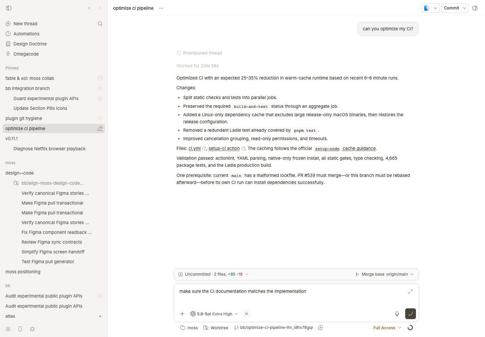

# Improve Prompt

Improve Prompt gives a rough bb composer draft one focused editing pass. It returns a clearer, context-complete request for you to review, without sending anything.




## Install

```bash
bb plugin install git:https://github.com/brsbl/bb-plugins.git@plugin/improve-prompt --yes
```

## Use

Write as roughly as you like, then choose **Improve prompt**. The revised text comes back in place for review; attachments stay attached, and you can undo the change.

While the rewrite is running, the composer is locked to prevent conflicting edits, the draft uses Improve Prompt's own shimmer treatment, and the same action becomes an accessible cancellation control. Cancelling aborts the client operation and stops the helper request; successful replacement restores focus to the composer.

The behavior comes from the installed `prompt-shaper` skill; the stable plugin ID remains `prompt-shaper` for compatibility.

## How it works

Prompt shaping and history learning are separate paths:

- **Composer path:** the plugin sends only the current draft to a standalone hidden helper. It may reuse the source thread's environment and execution settings, but it never reads or inherits that thread's transcript.
- **Maintenance path:** the plugin queues visible user threads when they become idle. `bb prompt-shaper history scan` reads only the unseen part of each queued episode through bb's timeline API, and a monthly maintenance agent updates the personal `prompt-shaper` skill only when a useful pattern recurs. A startup and monthly inventory check catches episodes missed while the plugin was offline.

bb gives the personal skill in `~/.bb/skills/prompt-shaper/` precedence over this plugin's bundled default, so future helpers automatically use the learned guidance without receiving raw history on every click.

The maintenance commands are bounded and resumable:

```bash
bb prompt-shaper history scan
bb prompt-shaper history advance --lease-id <id>
bb prompt-shaper history release --lease-id <id>
```

Add `--reconcile` to `history scan` to force an immediate inventory catch-up.

The UI is registered through `app.composer.customize(...)` as the `improve` composer action. Its component uses the context-bound `useComposer()` and `useComposerView()` hooks, so thread, queued-message, side-chat, and new-thread drafts are handled by their mounted composer instance.

## Develop

From the monorepo root:

```bash
npm ci
npm run check --workspace=bb-plugin-prompt-shaper
bb plugin install "path:$PWD/plugins/improve-prompt" --yes
```
