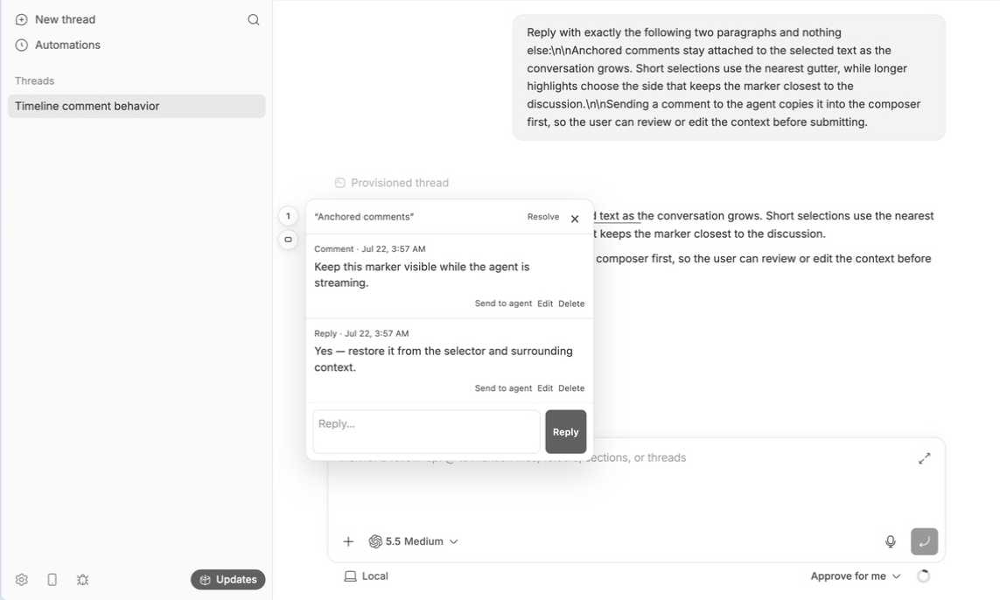
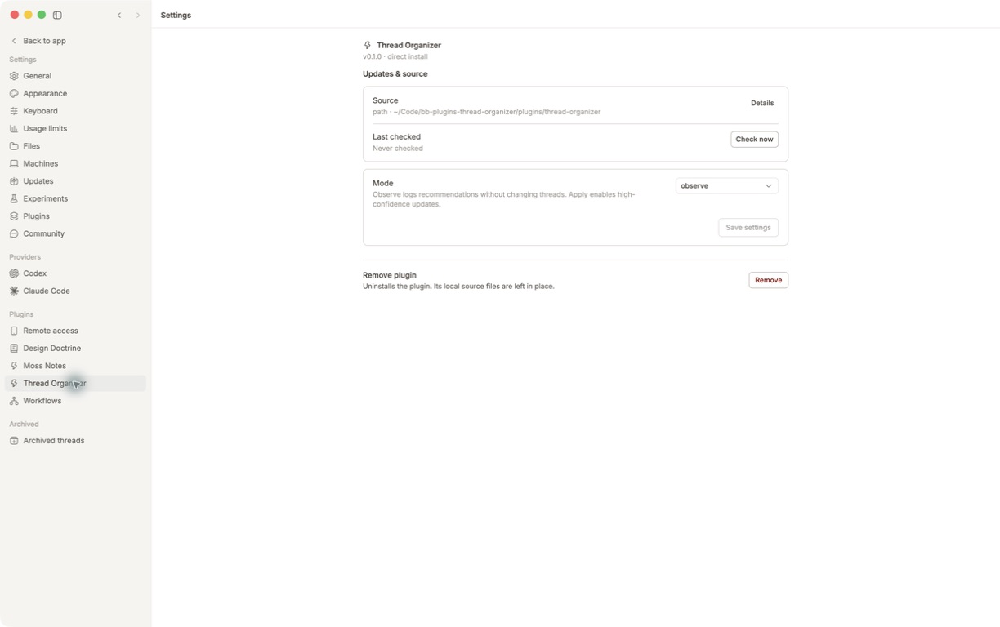

# bb plugins

Five bb plugins I use for product design work, kept together with the few build and repository tools they share. [](https://github.com/brsbl/bb-plugins/actions/workflows/ci.yml)

[bb](https://getbb.app) is an agentic IDE for running coding agents across projects, threads, and environments. Its plugins can add UI, commands, skills, and server capabilities; this repository is where I build and maintain mine.

## Plugins

Each plugin has its own workspace under `plugins/` and a short README with the story behind it.

### Design Doctrine

Keeps the design lessons that come up again and again in reviews as reusable rules.


[Source](plugins/design-doctrine) · [README](plugins/design-doctrine/README.md)

Install: `bb plugin install git:https://github.com/brsbl/bb-plugins.git@plugin/design-doctrine --yes`

### Improve Prompt

Turns a rough composer draft into a clearer, context-complete prompt before you send it.


[Source](plugins/improve-prompt) · [README](plugins/improve-prompt/README.md)

Install: `bb plugin install git:https://github.com/brsbl/bb-plugins.git@plugin/improve-prompt --yes`

### Thread Hover Cards

Lets you peek at a thread's status and repository context without leaving the sidebar.


[Source](plugins/thread-hover-cards) · [README](plugins/thread-hover-cards/README.md)

Install: `bb plugin install git:https://github.com/brsbl/bb-plugins.git@plugin/thread-hover-cards --yes`

### Timeline Comments

Keeps comments and comment threads attached to exact text in bb timelines.



[Source](plugins/timeline-comments) · [README](plugins/timeline-comments/README.md)

Install: `bb plugin install git:https://github.com/brsbl/bb-plugins.git@plugin/timeline-comments --yes`

### Thread Organizer

Files new threads into the right existing work section while preserving native titles and every manual override.



[Source](plugins/thread-organizer) · [README](plugins/thread-organizer/README.md)

Install: `bb plugin install git:https://github.com/brsbl/bb-plugins.git@plugin/thread-organizer --yes`

### UI Patterns

Puts proven UI components and interaction guidance within reach of both designers and agents.


[Source](plugins/ui-patterns) · [README](plugins/ui-patterns/README.md)

Install: `bb plugin install git:https://github.com/brsbl/bb-plugins.git@plugin/ui-patterns --yes`

Each `plugin/*` install ref is generated from `main` after CI passes. The separate refs are necessary because bb installs from the root of a git checkout.

## Develop

The root tooling handles the unglamorous shared work: finding plugin workspaces, building them, checking the repository, validating artifacts, and publishing install refs. Runtime code, tests, SDK declarations, and UI stay with the plugin that owns them.

```bash
npm ci
npm run check
npm run new:plugin -- --slug example --name "Example" --description "Adds an example capability."
```

To work on one plugin, install its workspace directly: `bb plugin install "path:$PWD/plugins/<slug>" --yes`.

See [contributor guidance](CONTRIBUTING.md) and [repository tooling](tooling/README.md).
