# bb plugins

Eight bb plugins I use for product design work, kept together with the few build and repository tools they share. [](https://github.com/brsbl/bb-plugins/actions/workflows/ci.yml)

[bb](https://getbb.app) is an agentic IDE for running coding agents across projects, threads, and environments. Its plugins can add UI, commands, skills, and server capabilities; this repository is where I build and maintain mine.

## Plugins

Each plugin has its own workspace under `plugins/` and a short README with the story behind it.

### Design Doctrine

Turns recurring product-design feedback into a searchable rule library that agents can apply while designing, building, and critiquing. Its maintenance workflow keeps the rules grounded in real review evidence.

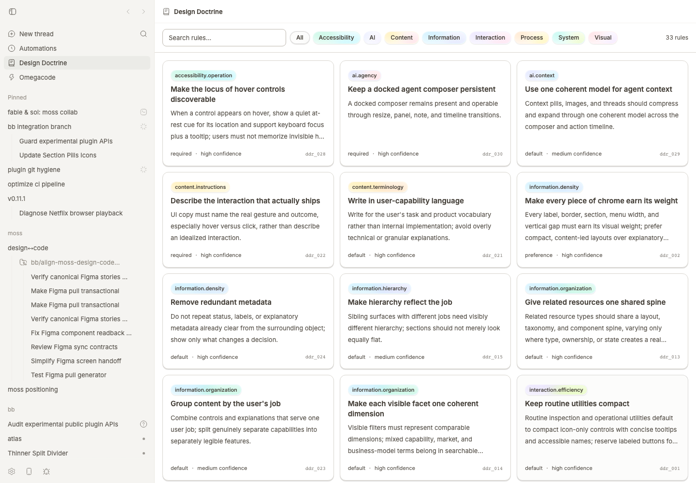

[Source](plugins/design-doctrine) · [README](plugins/design-doctrine/README.md)

Install: `bb plugin install git:https://github.com/brsbl/bb-plugins.git@plugin/design-doctrine --yes`

### GitHub Activity

Brings incoming comments and mentions from GitHub pull requests and issues you authored into one searchable, filterable triage view, with open and resolved activity kept together.

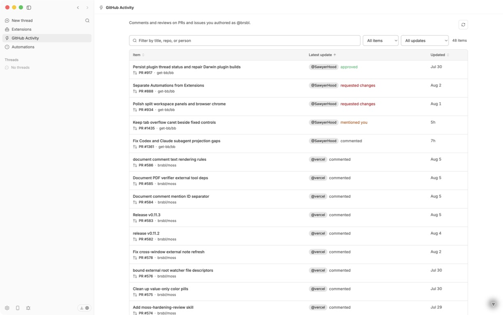

[Source](plugins/github-notifications) · [README](plugins/github-notifications/README.md)

Install: `bb plugin install git:https://github.com/brsbl/bb-plugins.git@plugin/github-notifications --yes`

### Prompt Improver

Rewrites a rough bb composer draft into a clearer, context-complete prompt for review before you send it. The rewrite can be cancelled or undone without leaving the composer.

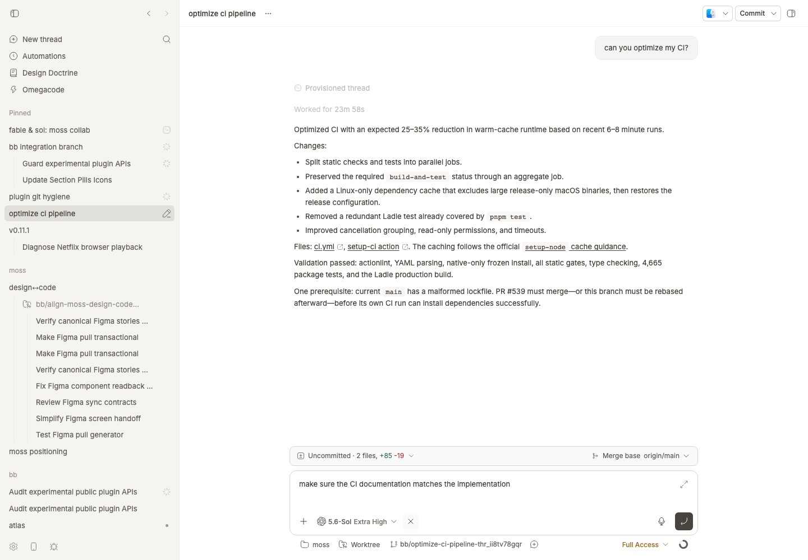

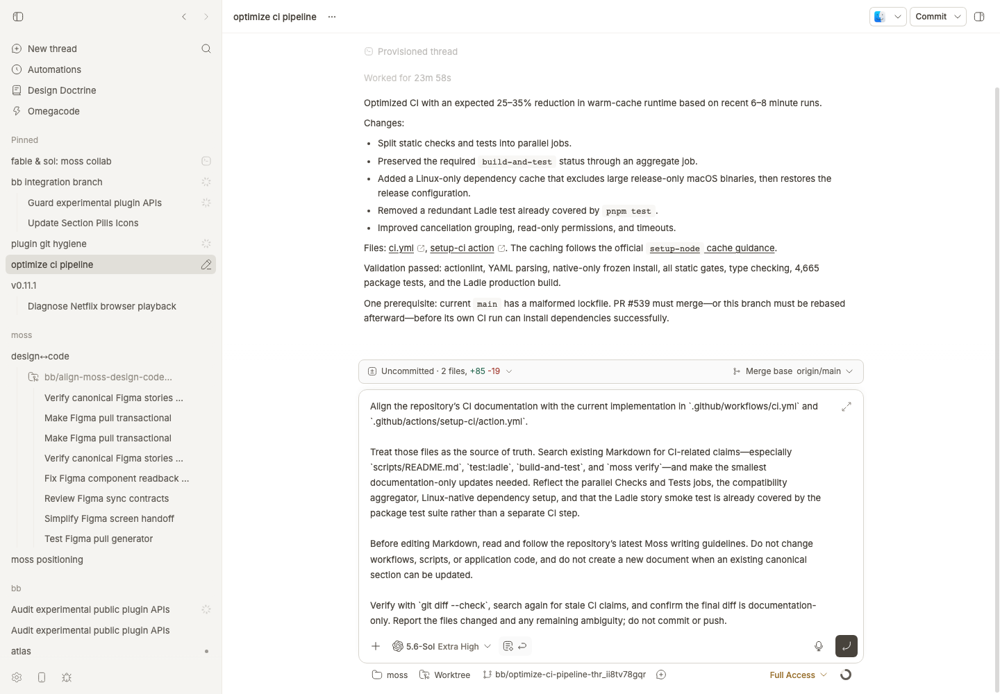

[Source](plugins/improve-prompt) · [README](plugins/improve-prompt/README.md)

Install: `bb plugin install git:https://github.com/brsbl/bb-plugins.git@plugin/improve-prompt --yes`

### Thread Hover Cards

Shows a thread's live status, latest agent update, execution context, repository, and pull request without leaving the sidebar. Collapsed sections get a compact summary of their thread count and attention state.

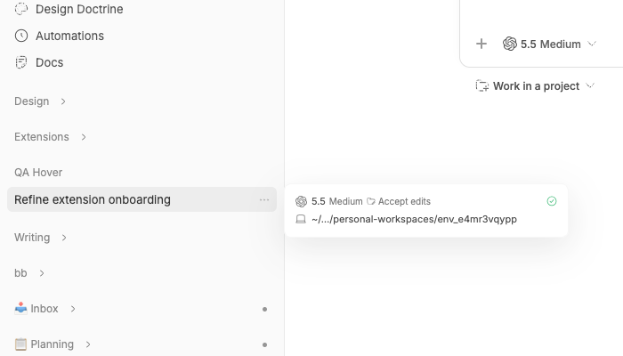

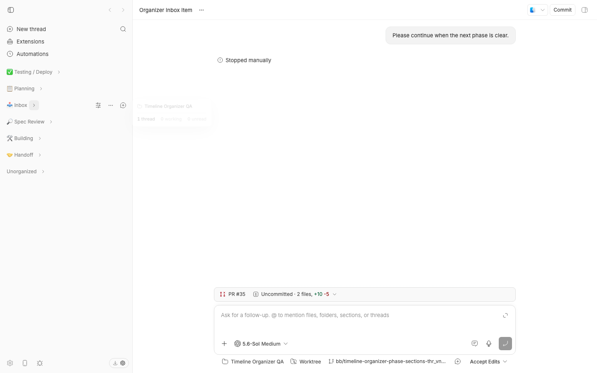

[Source](plugins/thread-hover-cards) · [README](plugins/thread-hover-cards/README.md)

Install: `bb plugin install git:https://github.com/brsbl/bb-plugins.git@plugin/thread-hover-cards --yes`

### Thread Organizer

Organizes work into configurable workflow sections, keeps unread idle threads in Inbox until work resumes, and reassesses titles after semantic stage transitions.

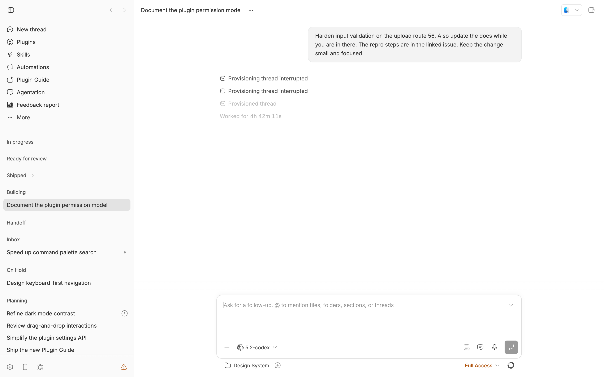

[Source](plugins/thread-organizer) · [README](plugins/thread-organizer/README.md)

Install: `bb plugin install git:https://github.com/brsbl/bb-plugins.git@plugin/thread-organizer --yes`

### Mesh Gradient

Creates, edits, saves, and shares reusable mesh gradients from a visual studio beside a thread. Users can hand an exact saved gradient to the current agent, while agents can generate gradients, inspect the shared library, and apply saved designs through the same plugin.

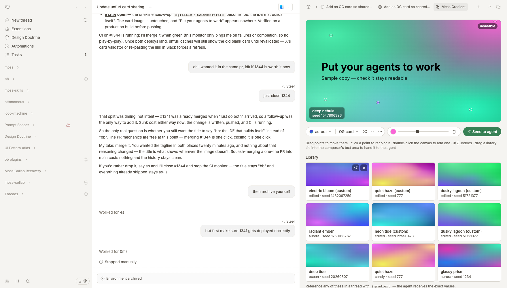

[Source](plugins/mesh-gradient) · [README](plugins/mesh-gradient/README.md)

Install: `bb plugin install git:https://github.com/brsbl/bb-plugins.git@plugin/mesh-gradient --yes`

### Endless

Frank Ocean's *Endless* as a bb palette — achromatic, grained, squared. Ten years to the day.

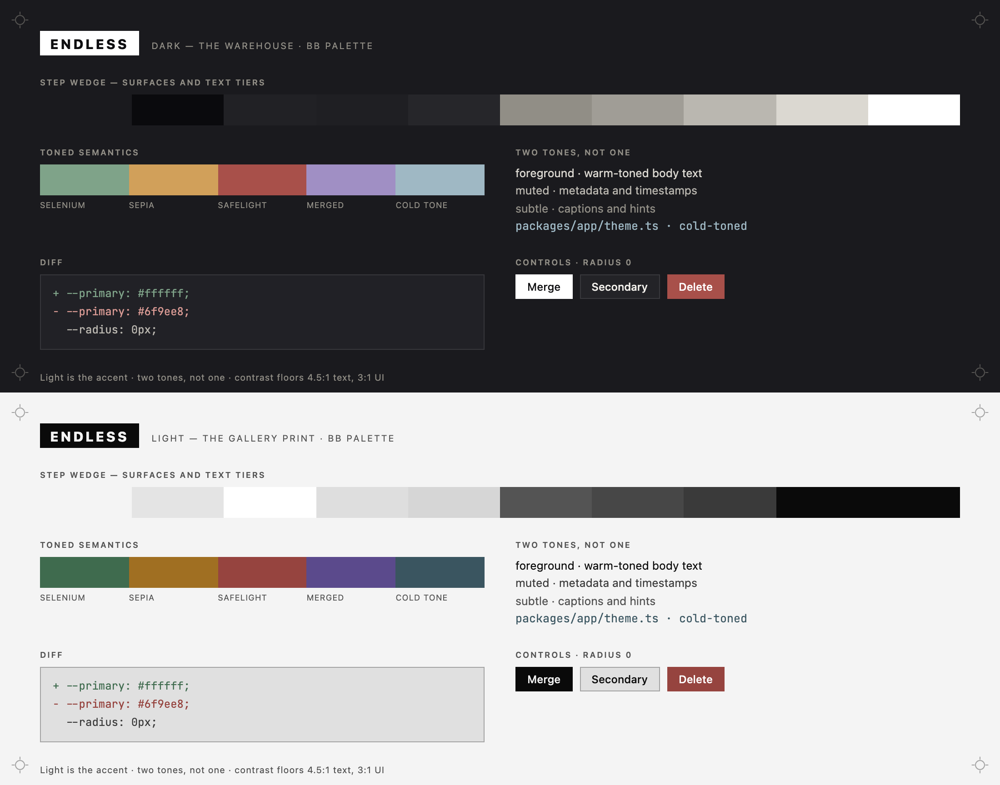

[Source](plugins/endless) · [README](plugins/endless/README.md)

Install: `bb plugin install git:https://github.com/brsbl/bb-plugins.git@plugin/endless --yes`

### Timeline Comments

Attaches durable discussion threads to selected timeline text. Users and agents can reply, edit, resolve or reopen comments, review them together, and add open feedback to the composer for follow-up.

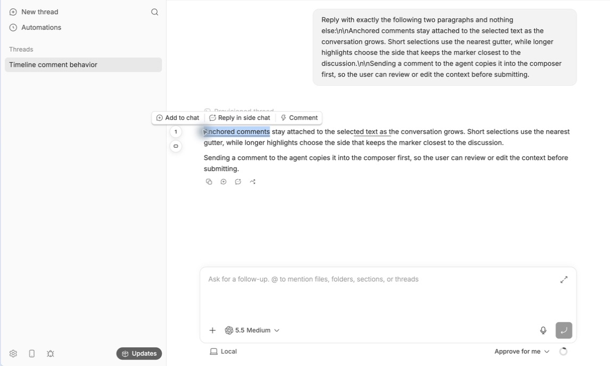

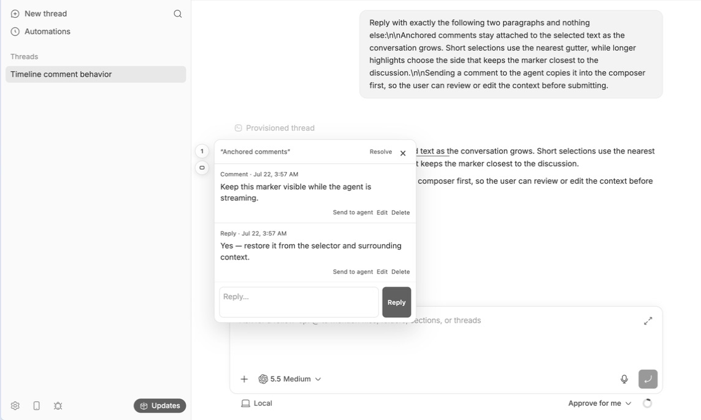

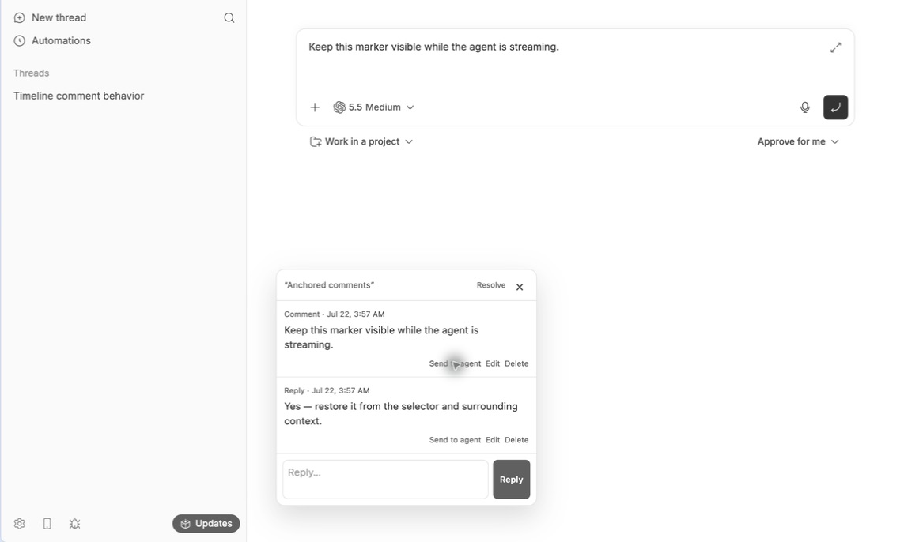

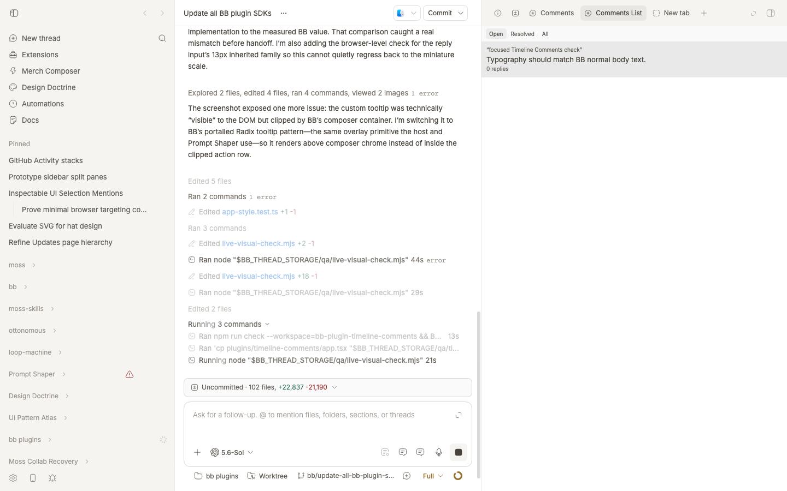

[Source](plugins/timeline-comments) · [README](plugins/timeline-comments/README.md)

Install: `bb plugin install git:https://github.com/brsbl/bb-plugins.git@plugin/timeline-comments --yes`

Each `plugin/*` install ref is generated from `main` after CI passes. The separate refs are necessary because bb installs from the root of a git checkout.

## Develop

The root tooling handles the unglamorous shared work: finding plugin workspaces, building them, checking the repository, validating artifacts, and publishing install refs. Runtime code, tests, SDK declarations, and UI stay with the plugin that owns them.

```bash
npm ci
npm run check
npm run new:plugin -- --slug example --name "Example" --description "Adds an example capability."
```

To work on one plugin, install its workspace directly: `bb plugin install "path:$PWD/plugins/<slug>" --yes`.

See [contributor guidance](CONTRIBUTING.md), the [plugin catalog entry template](tooling/plugin-catalog-entry.md), and [repository tooling](tooling/README.md).
