# bb plugins

Personal bb plugins I use for product design work, kept together with the few build and repository tools they share. [](https://github.com/brsbl/bb-plugins/actions/workflows/ci.yml)

[bb](https://getbb.app) is an agentic IDE for running coding agents across projects, threads, and environments. Its plugins can add UI, commands, skills, and server capabilities; this repository is where I build and maintain mine.

## Plugins

Each plugin has its own workspace under `plugins/` and a short README with the story behind it.

### Design Doctrine

Turns recurring product-design feedback into a searchable rule library that agents can apply while designing, building, and critiquing. Its maintenance workflow keeps the rules grounded in real review evidence.

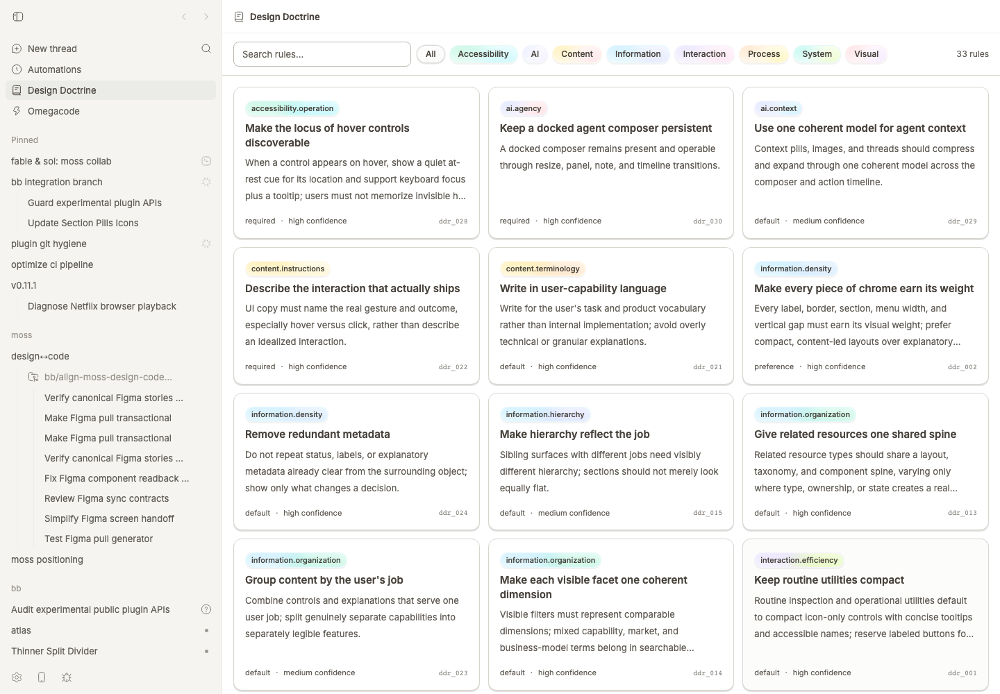

[Source](plugins/design-doctrine) · [README](plugins/design-doctrine/README.md)

Install: `bb plugin install git:https://github.com/brsbl/bb-plugins.git@plugin/design-doctrine --yes`

### Digests

Delivers private briefings as threads with numbered priorities, review buttons, and collapsed routine details. Add or edit a prompt-based digest under the site it reads in Settings. Connections reuse existing bb Browser sign-ins; Reading remembers summarized newsletters without marking them read. Other threads can publish their own issues.


[Source](plugins/digests) · [README](plugins/digests/README.md)

Install: `bb plugin install git:https://github.com/brsbl/bb-plugins.git@plugin/digests --yes`

### FPL Draft

Follow your Fantasy Premier League Draft league’s matches and standings, compare waiver options, and bring the current view into an agent conversation with a context pill.


[Source](plugins/fpl-draft) · [README](plugins/fpl-draft/README.md)

Install: `bb plugin install git:https://github.com/brsbl/bb-plugins.git@plugin/fpl-draft --yes`

### GitHub Activity

Brings incoming comments and mentions from GitHub pull requests and issues you authored into one searchable, filterable triage view, with open and resolved activity kept together.

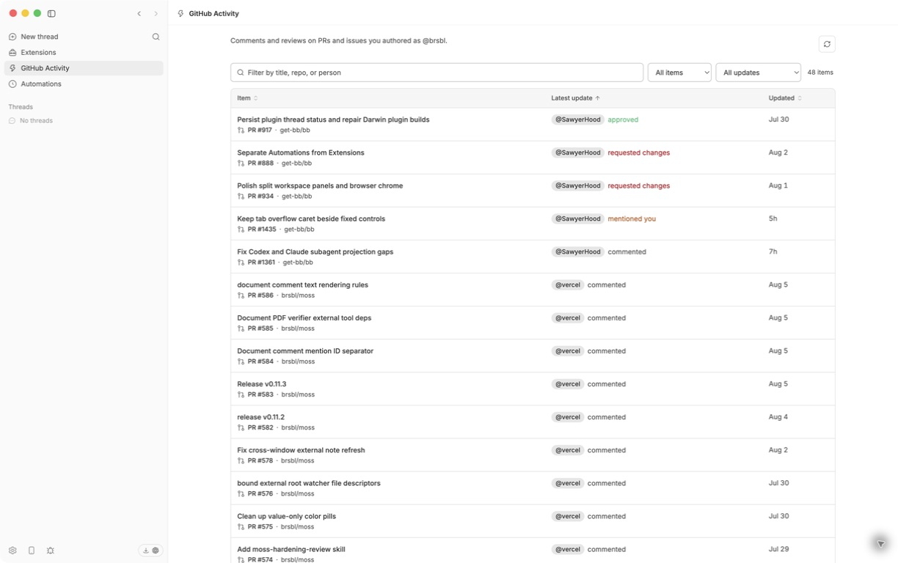

[Source](plugins/github-notifications) · [README](plugins/github-notifications/README.md)

Install: `bb plugin install git:https://github.com/brsbl/bb-plugins.git@plugin/github-notifications --yes`

### Prompt Improver

Rewrites a rough bb composer draft into a clearer, context-complete prompt for review before you send it. The rewrite can be cancelled or undone without leaving the composer.

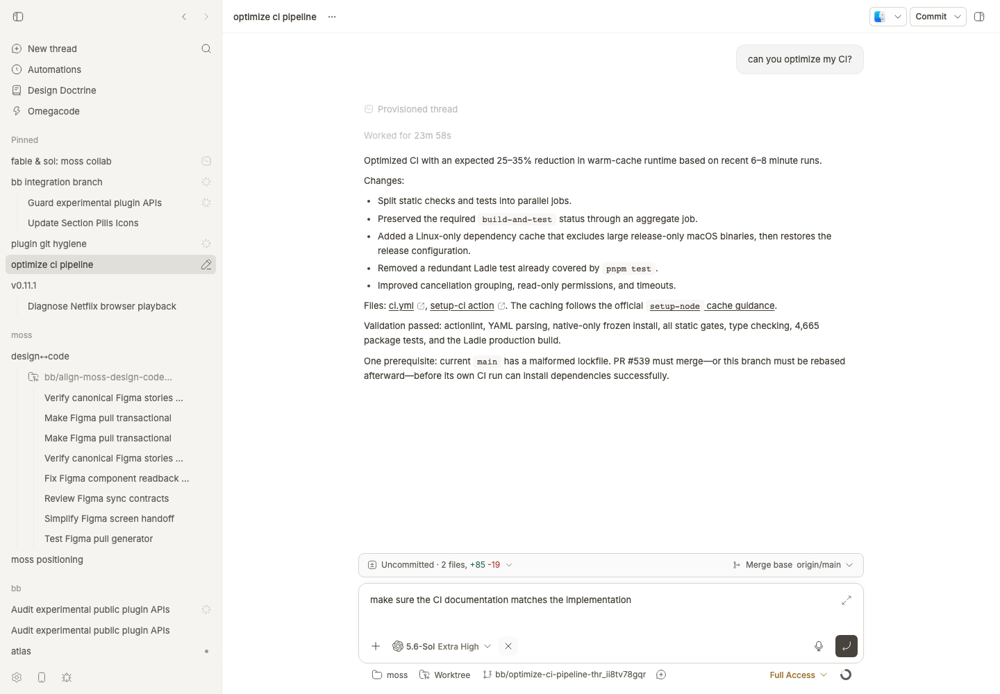

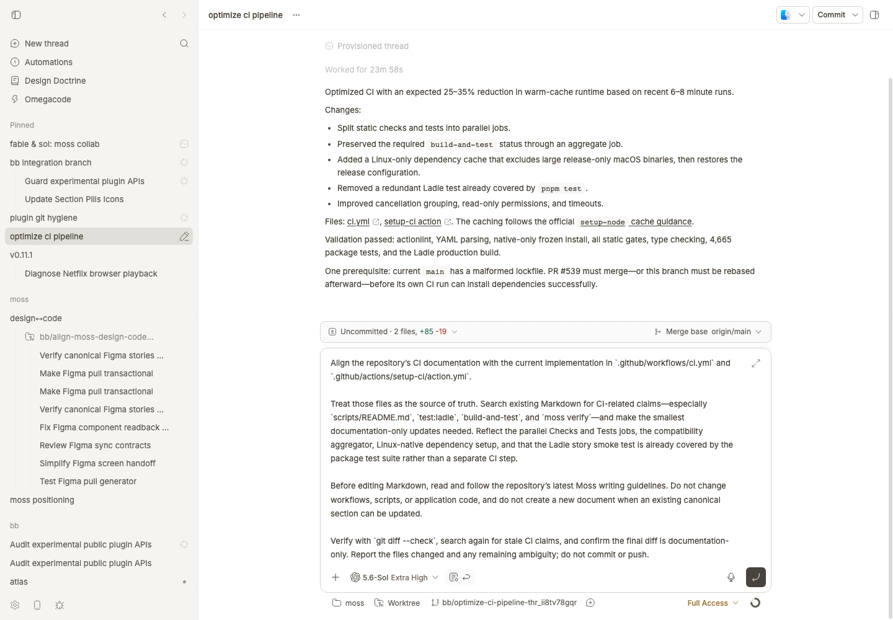

[Source](plugins/improve-prompt) · [README](plugins/improve-prompt/README.md)

Install: `bb plugin install git:https://github.com/brsbl/bb-plugins.git@plugin/improve-prompt --yes`

### Thread Hover Cards

Shows a thread's live status, latest agent update, execution context, repository, and pull request without leaving the sidebar. Collapsed sections get a compact summary of their thread count and attention state.

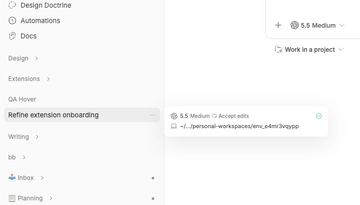

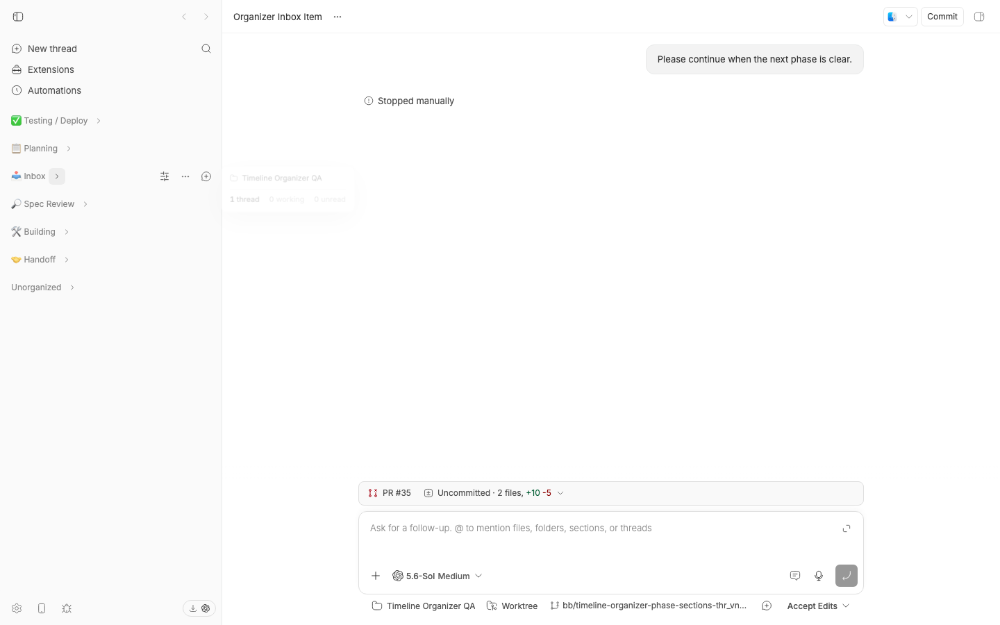

[Source](plugins/thread-hover-cards) · [README](plugins/thread-hover-cards/README.md)

Install: `bb plugin install git:https://github.com/brsbl/bb-plugins.git@plugin/thread-hover-cards --yes`

### Thread Organizer

Organizes work into configurable workflow sections that agents follow, and keeps unread idle threads in Inbox. Sections can opt out of Inbox so their unread threads stay in place. Each section can carry an entry prompt that every arriving thread receives, so a review section can start a review and a testing section can ask for evidence.

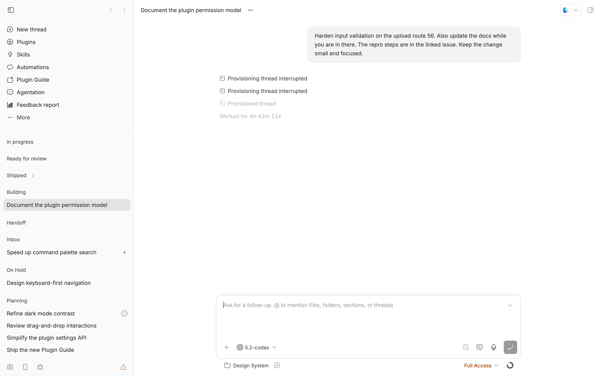


[Source](plugins/thread-organizer) · [README](plugins/thread-organizer/README.md)

Install: `bb plugin install git:https://github.com/brsbl/bb-plugins.git@plugin/thread-organizer --yes`

### Context Katamari

Shows how full each thread's context window is as a Katamari Damacy-style ball in a floating window. The ball grows as context fills, pops when the thread compacts, and rolls only while the thread is working.

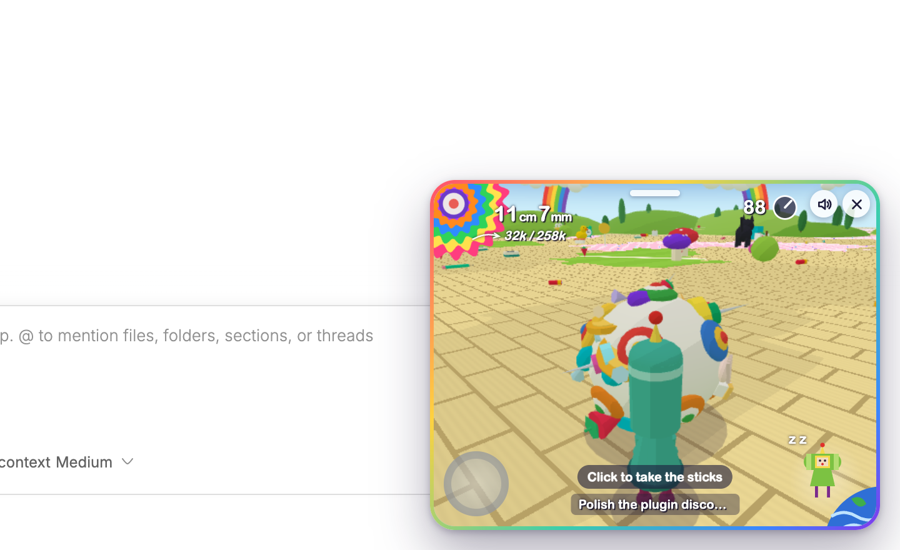

[Source](plugins/context-katamari) · [README](plugins/context-katamari/README.md)

Install: `bb plugin install git:https://github.com/brsbl/bb-plugins.git@plugin/context-katamari --yes`

### Inline Action Cards

Edit email replies and approve decisions inside agent messages. Review one item or a group in a table, and track waiting choices and results across threads in the Action log.


[Source](plugins/inline-action-cards) · [README](plugins/inline-action-cards/README.md)

Install: `bb plugin install git:https://github.com/brsbl/bb-plugins.git@plugin/inline-action-cards --yes`

### Mesh Gradient

Creates, edits, saves, and shares reusable mesh gradients from a visual studio beside a thread. Users can hand an exact saved gradient to the current agent, while agents can generate gradients, inspect the shared library, and apply saved designs through the same plugin.

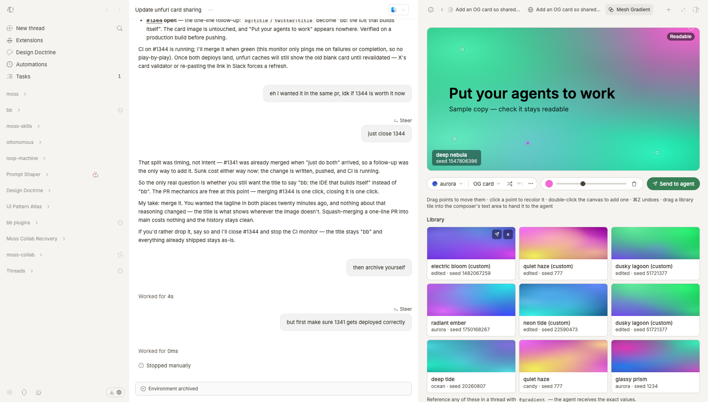

[Source](plugins/mesh-gradient) · [README](plugins/mesh-gradient/README.md)

Install: `bb plugin install git:https://github.com/brsbl/bb-plugins.git@plugin/mesh-gradient --yes`

### Emoji Picker

Type `:` in a composer to open the picker, then choose an emoji to replace the colon. Search by name or shortcode, browse categories, and keep recent choices and a preferred skin tone close at hand.


[Source](plugins/emoji-picker) · [README](plugins/emoji-picker/README.md)

Install: `bb plugin install git:https://github.com/brsbl/bb-plugins.git@plugin/emoji-picker --yes`

### Endless

Frank Ocean's *Endless* as a bb palette — achromatic, grained, squared. Ten years to the day.

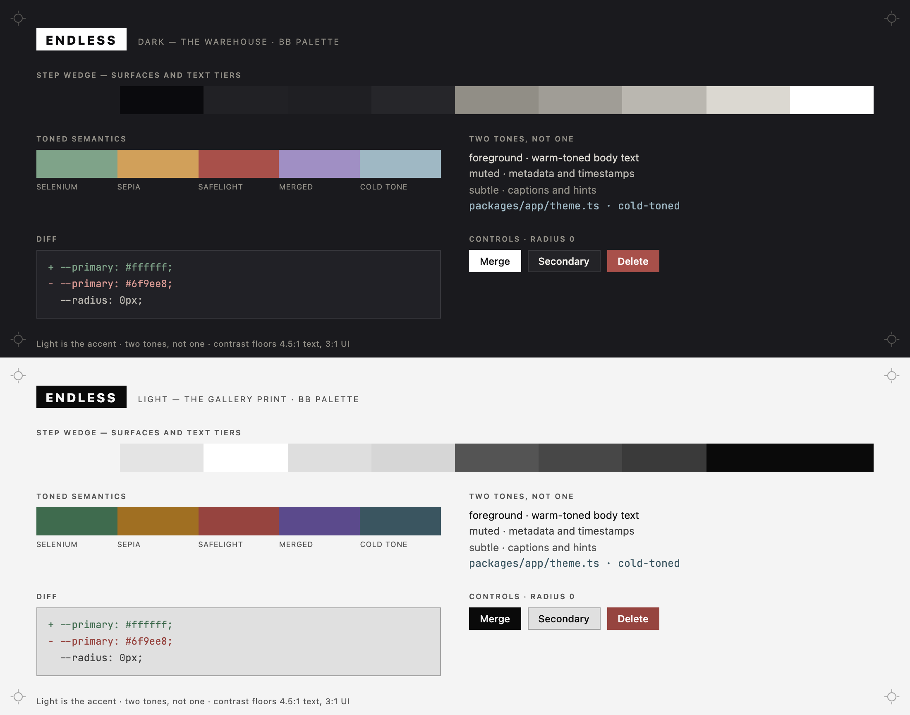

[Source](plugins/endless) · [README](plugins/endless/README.md)

Install: `bb plugin install git:https://github.com/brsbl/bb-plugins.git@plugin/endless --yes`

### Theme Preview

A skeleton of the bb app in every configuration — sidebar, splits, panels, overlays, real thread timelines and controls — drawn from the active theme's tokens, so a palette can be judged before it ships.

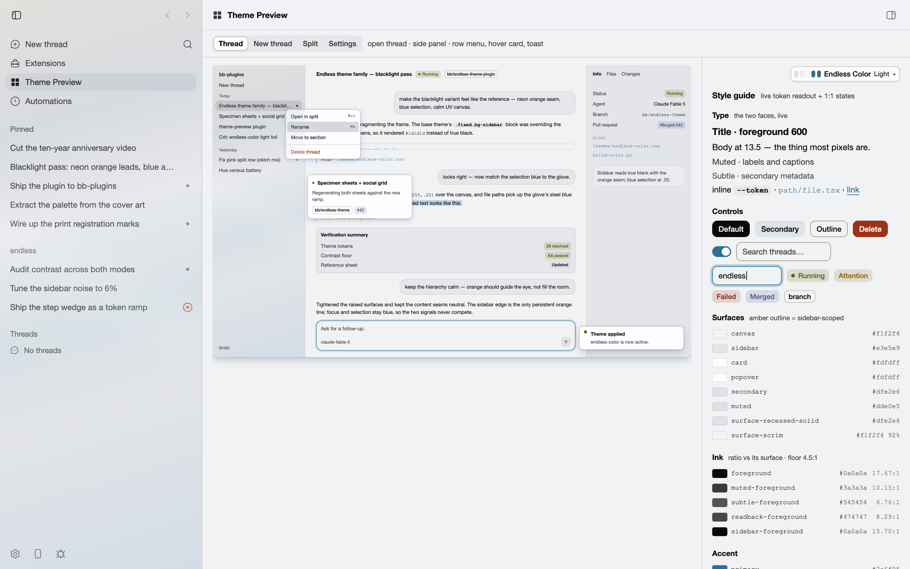

[Source](plugins/theme-preview) · [README](plugins/theme-preview/README.md)

Install: `bb plugin install git:https://github.com/brsbl/bb-plugins.git@plugin/theme-preview --yes`

### Color Swatches

Renders an inline swatch beside every color literal in a thread — hex, `rgb()`, `hsl()`, `oklch()` and friends — the way an editor decorates code.

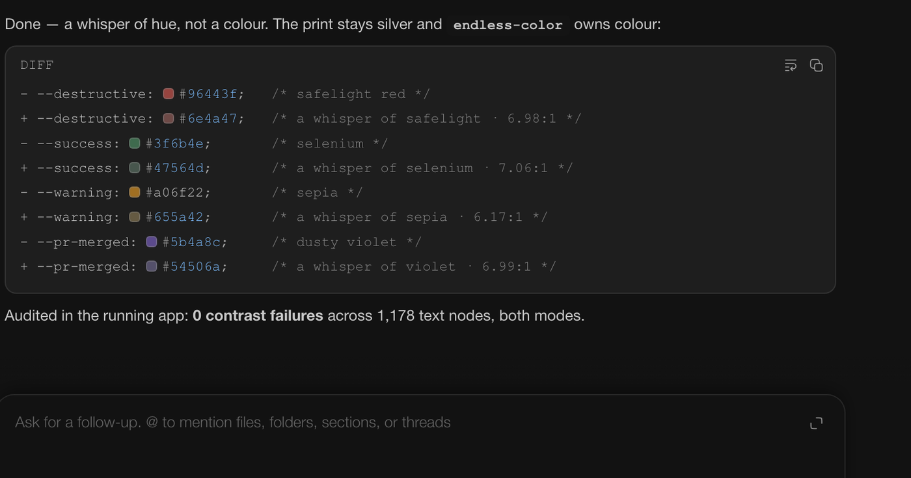

[Source](plugins/color-swatches) · [README](plugins/color-swatches/README.md)

Install: `bb plugin install git:https://github.com/brsbl/bb-plugins.git@plugin/color-swatches --yes`

### Compact Links

Turns website URLs into compact favicon pills in the composer, sent messages and agent replies. Click a link to open it using your bb browser preference.


[Source](plugins/url-pills) · [README](plugins/url-pills/README.md)

Install: `bb plugin install git:https://github.com/brsbl/bb-plugins.git@plugin/url-pills --yes`

### Open in Moss

Makes local Markdown links in bb open directly in Moss, with bb's viewer kept as the fallback.

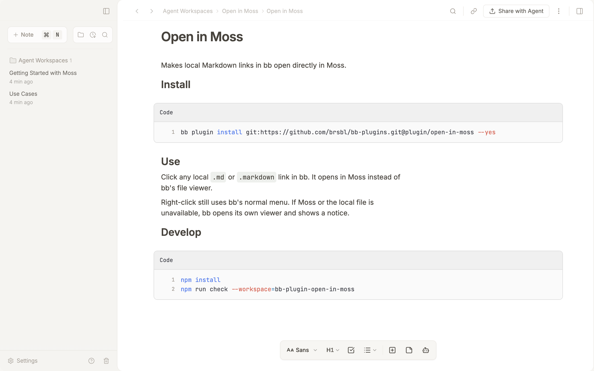

[Source](plugins/open-in-moss) · [README](plugins/open-in-moss/README.md)

Install: `bb plugin install git:https://github.com/brsbl/bb-plugins.git@plugin/open-in-moss --yes`

### Moss Viewer

Reads and edits Moss notes in a bb panel the way Moss does: tabs, tables, wiki links, post embeds, charts, live HTML blocks, comments, and note-local images and video. Notes in ~/Moss/Notes open in Moss's own editor and save to their files on the Mac that holds them; other Moss notes open read-only.


[Source](plugins/moss-viewer) · [README](plugins/moss-viewer/README.md)

Install: `bb plugin install git:https://github.com/brsbl/bb-plugins.git@plugin/moss-viewer --yes`

### Saved Places

Your saved places on a map that gets clearer as you zoom, with lists, notes, walking distance between saves, and an Ask agent button that hands the current view to a new thread. It now lives in its own template repository, [brsbl/saved-places](https://github.com/brsbl/saved-places), so you can make a copy with your own Google Maps saves.

Install: `bb plugin install git:https://github.com/brsbl/saved-places.git --yes`

### Plugin Finder

Find installed and Community plugins with `#plugin` or `@plugin` or let your agent search through the CLI, with full overviews and screenshot links.

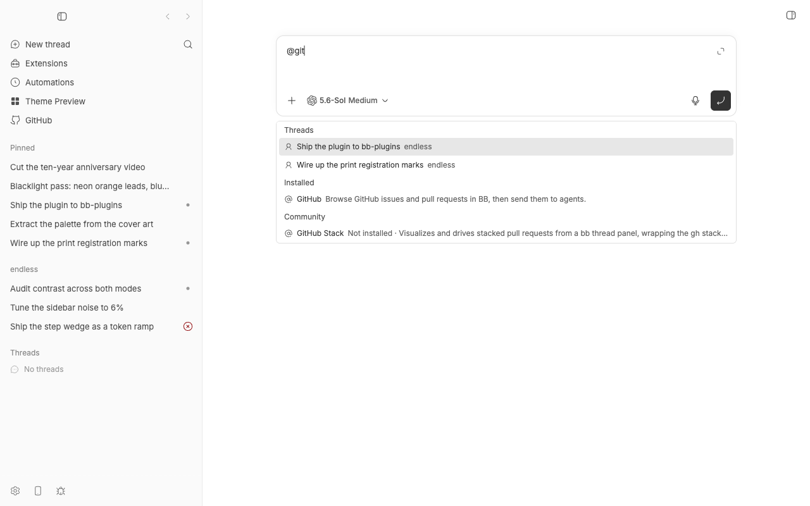

[Source](plugins/at-plugin) · [README](plugins/at-plugin/README.md)

Install: `bb plugin install git:https://github.com/brsbl/bb-plugins.git@plugin/at-plugin --yes`

### Timeline Comments

Attaches durable discussion threads to selected timeline text. Users and agents can reply, edit, resolve or reopen comments, review them together, and add open feedback to the composer for follow-up.

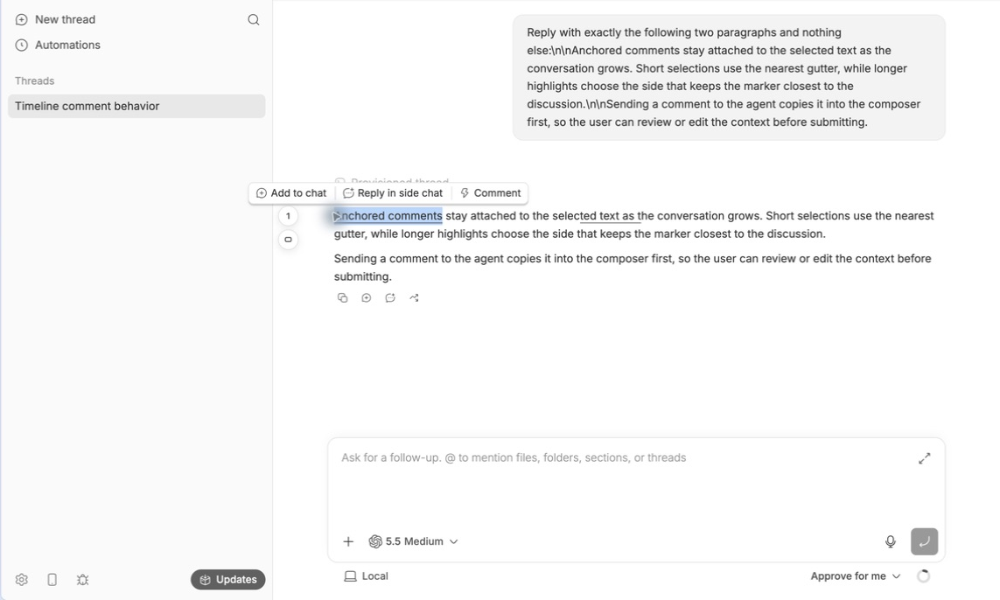

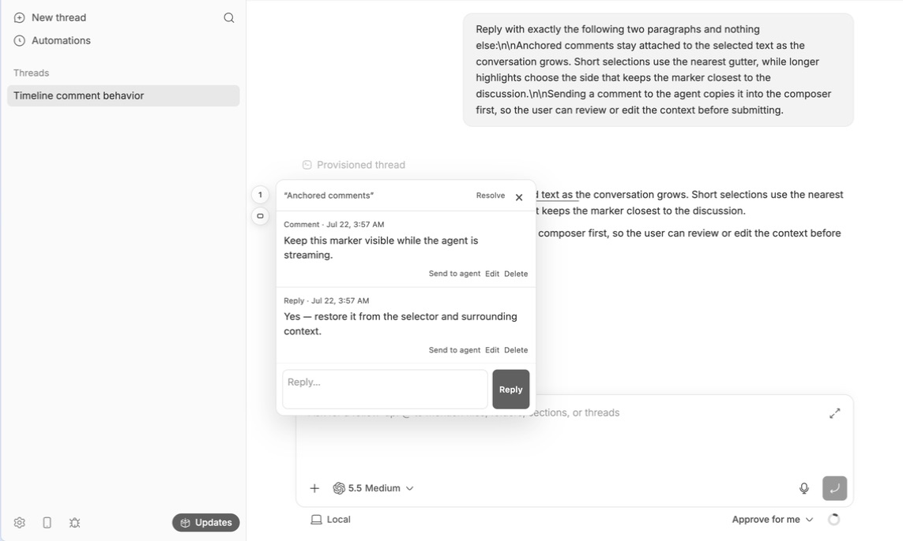

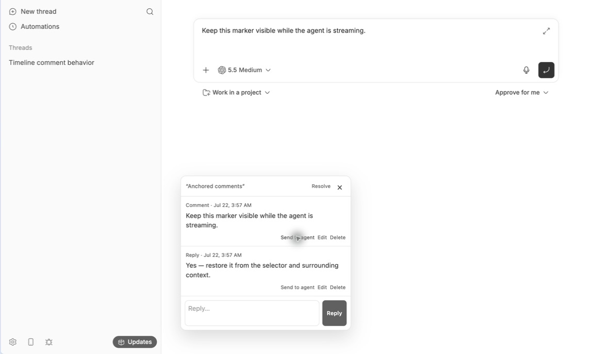

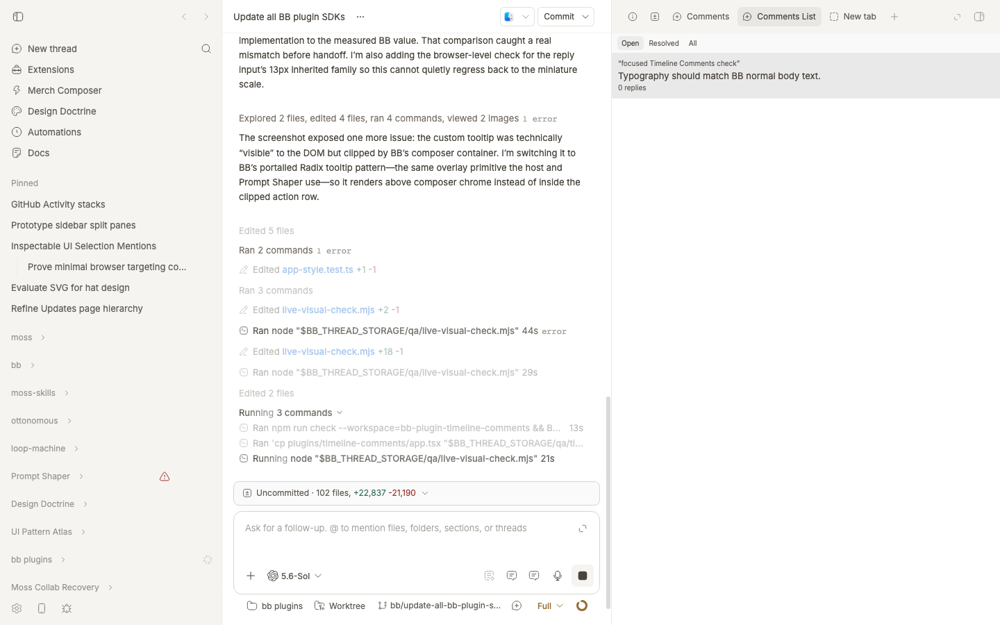

[Source](plugins/timeline-comments) · [README](plugins/timeline-comments/README.md)

Install: `bb plugin install git:https://github.com/brsbl/bb-plugins.git@plugin/timeline-comments --yes`

### Desktop

Turns bb's new-thread page into a Windows XP desktop for your agents. Folders mirror your sidebar, threads open as instant-message windows beside a Buddy List of their project, and a taskbar and Start menu launch XP programs and games, including a real terminal and in-app browser.

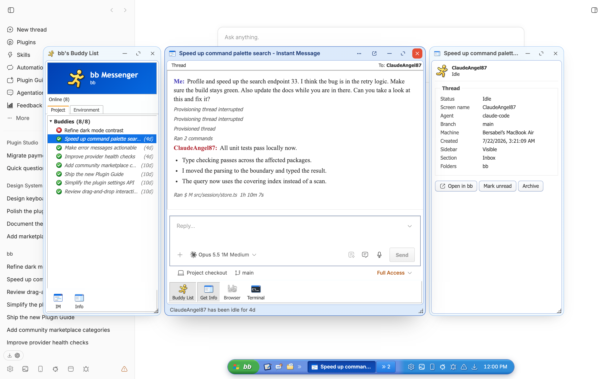

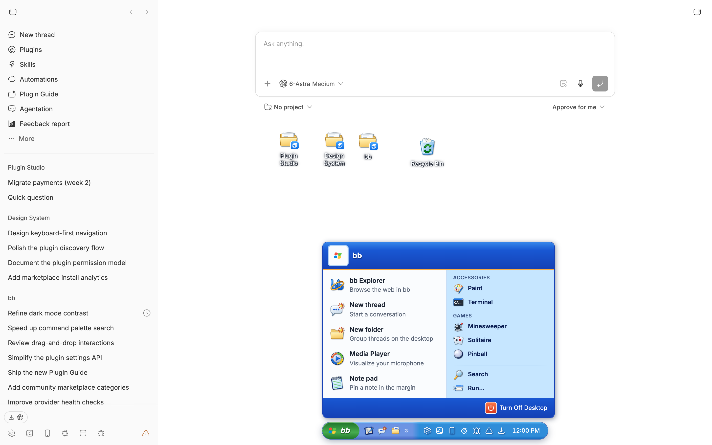

[Source](plugins/desktop) · [README](plugins/desktop/README.md)

Install: `bb plugin install git:https://github.com/brsbl/bb-plugins.git@plugin/desktop --yes`

### Ambient

Paints a living generative background behind bb that reacts to your agents: working threads drift through it as lights, threads waiting on you pulse, and finished turns ripple outward. Tune any scene with its own sliders and palette, or ask an agent to write a new one.

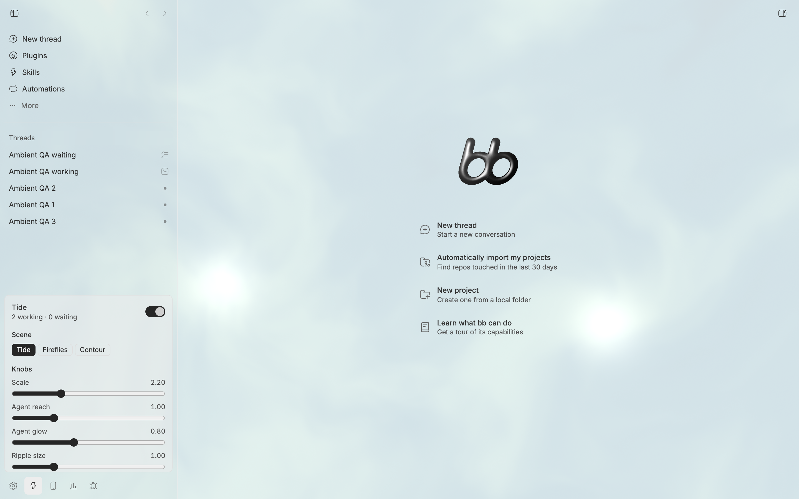

Contour draws a calm night map with muted gold lines and agent peaks.

[Source](plugins/ambient) · [README](plugins/ambient/README.md)

Install: `bb plugin install git:https://github.com/brsbl/bb-plugins.git@plugin/ambient --yes`

Each `plugin/*` install ref is generated from `main` after CI passes. The separate refs are necessary because bb installs from the root of a git checkout.

## Develop

The root tooling handles the unglamorous shared work: finding plugin workspaces, building them, checking the repository, validating artifacts, and publishing install refs. Runtime code, tests, SDK declarations, and UI stay with the plugin that owns them.

```bash
npm ci
npm run check
npm run new:plugin -- --slug example --name "Example" --description "Adds an example capability."
```

To work on one plugin, install its workspace directly: `bb plugin install "path:$PWD/plugins/<slug>" --yes`.

See [contributor guidance](CONTRIBUTING.md), the [plugin catalog entry template](tooling/plugin-catalog-entry.md), and [repository tooling](tooling/README.md).

### Pinned Files

Keep local files within reach in each thread with persistent pins above the composer. Ask the agent to pin files from the composer's pin button or use the CLI, and open pins through bb's file links.


[Source](plugins/file-pins) · [README](plugins/file-pins/README.md)

Install: `bb plugin install git:https://github.com/brsbl/bb-plugins.git@plugin/file-pins --yes`

### Coordinator Mode

Turn any thread into a coordinator that tracks your asks as items, starts sub-threads for them, and moves each item forward only on real evidence such as a merged PR or your approval. Coordinator rules decide what it may do alone, must ask about, or must never do.


[Source](plugins/coordinator-mode) · [README](plugins/coordinator-mode/README.md)

Install: `bb plugin install git:https://github.com/brsbl/bb-plugins.git@plugin/coordinator-mode --yes`
