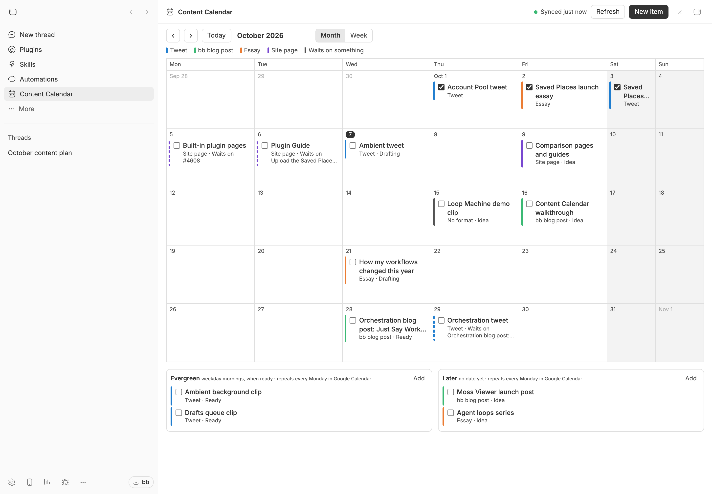

# Content Calendar

Plan deliverables on a month or week calendar. Every item is an all-day event on a dedicated Google calendar named **Content**, so the schedule also shows in Google Calendar and on your phone.



## Install

```bash
bb plugin install git:https://github.com/brsbl/bb-plugins.git@plugin/content-calendar --yes
```

## Use

1. Create a Google OAuth **Desktop app** client in your own Google Cloud project. The steps are in [the plugin skill](skills/content-calendar/SKILL.md#connect-google-one-time).
2. Save its client ID and secret in **Settings → Content Calendar**, or run `bb content-calendar connect` in a thread for a masked form.
3. Open **Content Calendar** in the sidebar and choose **Connect**. Approve in Google, then paste the address your browser lands on.

- **See the schedule** by month or week. The left rule is the format color, the checkbox means posted, and a dashed rule means the item waits on something.
- **Move items** by dragging, with **Move to…**, the **When** field, or the keyboard (Space, arrows, Space).
- **Undated work** sits in the Evergreen and Later trays. In Google Calendar each tray item repeats every Monday.
- **Attach** Moss notes and other files on your Mac, links, pull requests, and bb threads. Moss notes open in Moss.
- **Agents** use `bb content-calendar` and paste `::content-calendar{view="week" start="2026-10-05"}` to show a live calendar inline in chat.

Disconnecting or uninstalling leaves the Content calendar and every item in Google Calendar. `bb content-calendar export` writes every item as JSON.

## Develop

From the monorepo root:

```bash
npm ci
npm run check --workspace=bb-plugin-content-calendar
bb plugin install "path:$PWD/plugins/content-calendar" --yes
```

Tests run the sync engine against an in-memory fake of the Google Calendar API (`fake-google.ts`).
