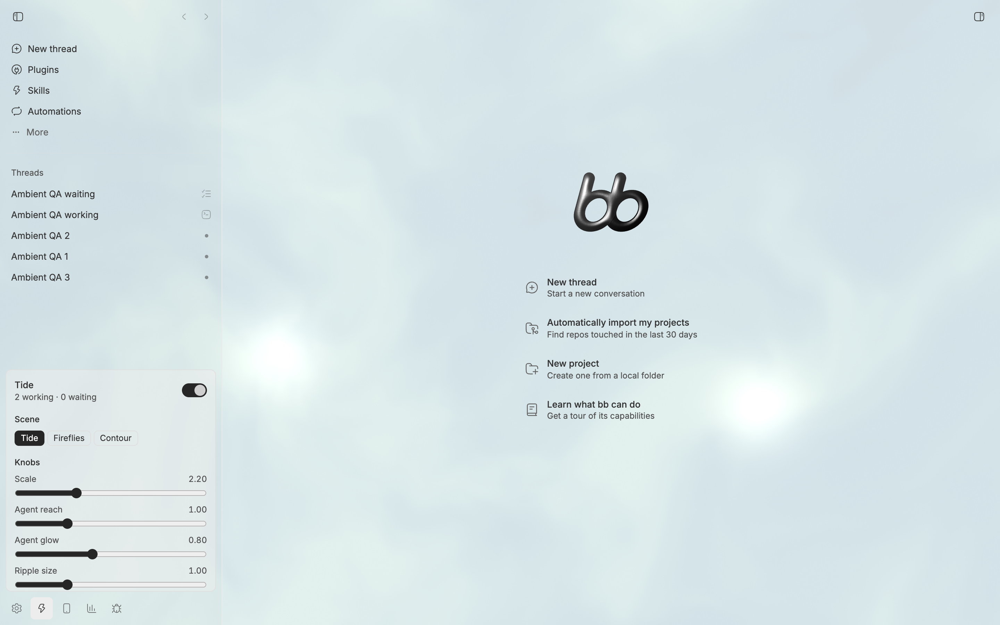

# Ambient

A living generative background for bb, driven by what your agents are doing.

Ambient paints a GLSL scene behind the bb UI. Working agents drift through it as
points of light, threads waiting on you pulse, finished turns send out ripples,
and errors ripple red. Open **Ambient** in the sidebar footer to switch scenes,
drag the scene's sliders, recolor its palette, and set how much of it shows
through bb's surfaces.



Agents collaborate on the scene through the `ambient` tool. They can read the
shader contract, write a new scene with its own sliders, get compile errors back,
and look at a captured frame. Ask an agent to "make the ambient background feel
like a slow aurora" and then tune the result with the knobs it gives you.

## Install

```bash
bb plugin install git:https://github.com/brsbl/bb-plugins.git@plugin/ambient --yes
```

## Use

| Surface | What it does |
| --- | --- |
| Sidebar footer → Ambient | Scene picker and Save; each scene's sliders and four colors; Display (Visibility: how much shows through bb, Motion: speed, Detail: render resolution); Preview a ripple |
| `ambient` agent tool | `get`, `set` (scene or controls), `look` (with visibility, motion, and cost checks), `library`, `load`, `save`, `delete`, `brief` |
| `bb ambient` | `status`, `list`, `load`, `set <param or visibility/motion/detail>=<value>`, `palette`, `save`, `delete`, `on`, `off`, `daily` |
| Sidebar footer → Ambient → New scene every morning | Creates a bb automation that runs after the hour you pick, in your time zone. Its agent asks the `ambient` tool for today's brief, then paints, checks, and saves a scene around a rotating concept. Pause, edit, or see run history in Automations; **Paint now** runs it immediately |

Built-in scenes: **Tide**, **Fireflies**, and **Contour**.

## Develop

From the monorepo root:

```bash
npm ci
npm run check --workspace=bb-plugin-ambient
bb plugin install "path:$PWD/plugins/ambient" --yes
```
