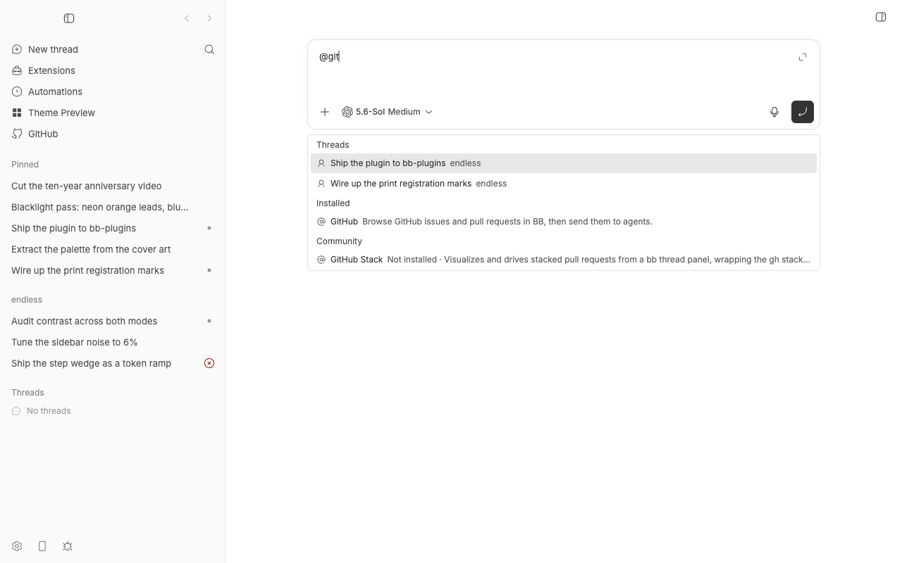

# @Plugin

Find plugins for your task from bb's `@` menu or let your agent search through the CLI.



## Install

```sh
bb plugin install git:https://github.com/brsbl/bb-plugins.git@plugin/at-plugin --yes
```

## Use

Use `#plugins` to browse installed and Community plugins, or type a name such as
`#auto`. The `#` trigger searches plugin mentions separately from the shared `@`
menu, so slow Docs or other `@` providers cannot hold up the results.

The existing `@` syntax remains available: type `@auto` and select a result.
Type `@plugin` to browse installed and Community plugins without
the usual six-results-per-group limit. Bare `@` does not return results in BB.

Installed results include all enabled, running plugins, including UI-only
plugins and themes. Disabled or unhealthy plugins are excluded. Community
results include compatible plugins that are not installed.

- An installed plugin mention tells the agent which available plugin to prefer
  when it is relevant.
- A Community plugin mention tells the agent that the plugin exists but must be
  installed before it can be used.

A mention never installs, enables, configures, authenticates, or invokes a
plugin by itself.

## Search coverage

Search matches names, plugin IDs, full descriptions, and available long-form
catalog overviews. Catalog search also matches tags, category, entry IDs, and
marketplace names. Installed name and description matches return without waiting for the catalog.
When there are no direct matches, installed search falls back to catalog details.
Mention search reuses successful catalog reads for up to 30 seconds (at most 64
queries), including the full catalog across different search terms. A slow catalog
read can finish in the background for up to 10 seconds after autocomplete stops
waiting, so the next search can reuse it. Failures are
retried on the next search. Installed status and selected mentions are checked
fresh; CLI reads remain fresh. A new or expired query can still wait for BB’s
catalog service.

Search does not crawl READMEs, documentation sites, or image contents. Older BB
versions and listings without overviews retain name/description search.

## Agent CLI

```sh
bb at-plugin search "pdf" --json
bb at-plugin search --scope community --limit 10 --offset 0 --json
bb at-plugin show <plugin-id> --json
```

Both commands return full descriptions, available overview text, and screenshot
and public icon URLs. Images are returned as links, not downloaded bytes. Search
defaults to 10 results, accepts `--limit 1..20`, and returns `nextOffset` for
pagination. Use `--scope installed`, `community`, or `all` (the default).
Omit `--json` for readable text. Check `warnings` for incomplete results and
`textTruncated` for unusually large text. These commands only read plugin data.

The plugin contributes CLI discovery metadata and an `at-plugin-discovery`
skill so agents can find and inspect plugins independently. Only enabled,
running installed plugins and compatible, uninstalled Community plugins appear.

## Develop

```sh
npm install
npm run check --workspace=bb-plugin-at-plugin
```
