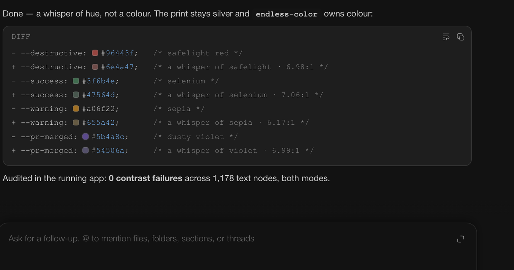

# Color Swatches

Makes CSS color literals visible at a glance in thread code and submitted user
messages — hex, `rgb()`, `hsl()`, `oklch()` and friends.



## Install

```sh
bb plugin install git:https://github.com/brsbl/bb-plugins.git@plugin/color-swatches --yes
```

## Use

Nothing to configure. Once installed, color literals get chips inside fenced
code blocks, diffs, and inline `` `#070509` `` code. A literal in the plain text
of a submitted user message gets the same square chip immediately before it.

The chip shows alpha over a checkerboard and carries a faint ring, so
`#ffffff` and `#000000` stay visible on any theme.

Two rendering paths keep thread behavior intact:

- **Code is never rewritten.** Its chip is drawn in `::before` from a custom
  property on bb's existing token, so streaming, selection, and copied text are
  unchanged.
- **Submitted user messages retain React's text node.** The plugin inserts a
  small chip host beside each literal without changing the copied text, and
  removes those hosts before React updates that message again.

The composer is never decorated.

## Develop

```sh
npm install
npm run check   # typecheck, build, test
bb plugin install "path:$PWD" --yes
```
