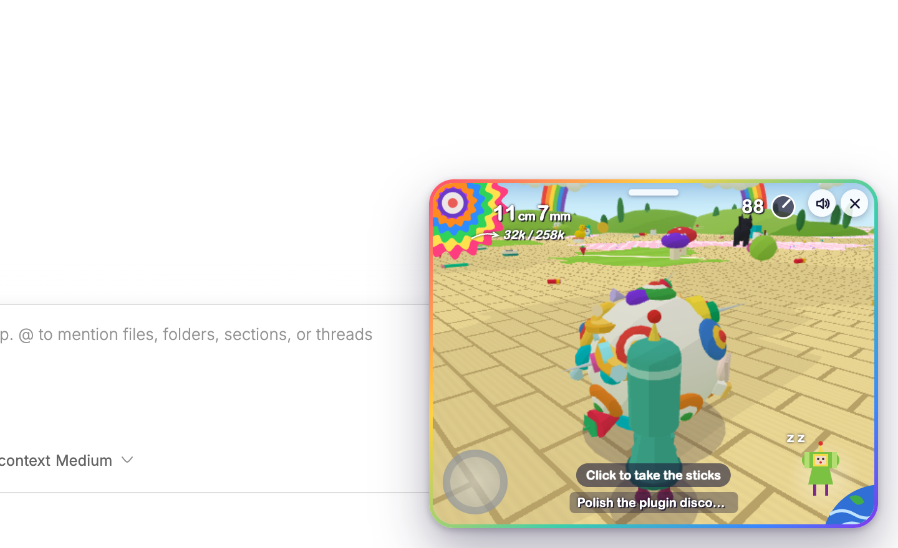

# Context Katamari

See how full a thread's context window is at a glance. A tiny royal cousin rolls a katamari around a toy-box world, and the ball grows as the thread's context fills.



## Install

```bash
bb plugin install git:https://github.com/brsbl/bb-plugins.git@plugin/context-katamari --yes
```

Requires bb 0.43 or newer.

## Use

Click the katamari button in the sidebar footer to open the floating window in the bottom-right corner. Drag the handle at its top edge to move it.

| What you see | What it means |
| --- | --- |
| Ball size and the gauge | How much of the context window the thread has used, measured against its auto-compact point when the provider reports one |
| The cousin rolling on his own, with music | The thread is working |
| The cousin standing still | The thread is idle or waiting for you |
| The cousin facing you and waving | You are on a page that is not a thread; the last thread's cousin waits for you |
| A 5mm speck under a towering cousin | A fresh thread with almost nothing in context |
| A chomp, and a "+18k" label; a screen-shaking GULP for a heavy turn | Context the latest reading swallowed, sized against the whole window |
| One bar per recent turn, top right | How much context each prompt added; hover a bar for the prompt |
| A grey first bar and a "+34k setup" gulp | A new thread's first turn, which mostly loads bb's system prompt and tools |
| A trail of coins behind the cousin | The thread has passed 50k tokens, so every turn re-reads a lot; the trail thickens as it grows |
| A ball popping, then shrinking | The thread just compacted |
| Stars orbiting the ball, and its core color and nubs | How many times the thread has compacted |
| A dizzy, staggering cousin with stars around his head | Each compaction leaves him woozier |

When a turn finishes, the King reads out its receipt: how much context the prompt swallowed. Compare a terse prompt with a "read everything" one to see how prompting style fills the context. bb keeps only a thread's latest usage report, so the plugin measures turns from the reports it sees; turns from before it was installed have no bars.

Switching threads rolls the previous cousin off screen and brings the new thread's cousin in. Each thread keeps its own cousin and ball.

Things only stick to the ball as the context grows; rolling into them otherwise just knocks them aside. The world changes with the ball's size, from a tatami room of thumbtacks and candy up to towns, beaches, forests, snowfields, and candy land, through a full day and night.

Click inside the window, then roll with the arrow keys: ↑ and ↓ push the katamari forward and back, ← and → steer. Escape lets go. Rolling has momentum and a hard crash knocks things loose. The arrow keys can always roll the katamari; on his own, the cousin only rolls while the thread is working.

The screen follows the game: the flower gauge and size readout with the token count as the goal, a clock showing how much context is left before compaction, the last object rolled up with its name, and the Prince on the Earth. The mute button silences the synthesized music and sound effects.

## Develop

From the monorepo root:

```bash
npm ci
npm run check --workspace=bb-plugin-context-katamari
bb plugin install "path:$PWD/plugins/context-katamari" --yes
```

The plugin depends on the published Plugin SDK 0.4.108 rather than the shared archive, because the app overlay and thread context APIs arrived after it.
