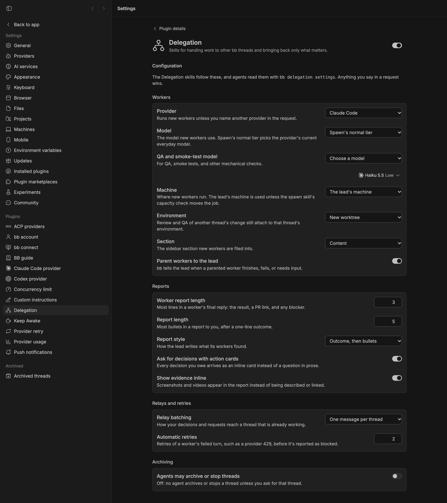

# Delegation

Skills for handing work to other bb threads and bringing back only what matters.



## Install

```bash
bb plugin install git:https://github.com/brsbl/bb-plugins.git@plugin/delegation --yes
```

## Use

Ask a thread to "launch an agent for this and parent it". The lead starts a worker, the worker does the job and replies once, and the lead passes on only what you need. Each job has one skill:

| Skill | Owns |
| --- | --- |
| `delegate` | Whether to spawn, the worker's self-contained prompt, and its provider, model, machine, environment, parent, section, and title |
| `relay` | Passing your decision or request to an existing thread in one batched message that quotes you |
| `collect-results` | Waiting on workers without polling, reading their reports and artifacts, and retrying stalls and provider errors |
| `report-results` | Short, batched reports with evidence inline and decisions as action cards |
| `thread-lifecycle` | Archiving, stopping, unparenting, and section moves, only when you ask |

The skills build on existing ones rather than repeating them: `spawn` for machine capacity and model tiers, `handoff` for transferring work in progress, `comms` for writing style, `inline-action-cards` for cards, `bb-thread-status-report` for every running thread, and `tidy` for post-merge cleanup.

### Settings

Settings → Delegation is a form: provider and machine dropdowns filled from your bb, bb's own model picker, your sidebar sections, switches, and number fields. Each change saves on its own. Agents read the same values with `bb delegation settings --json`, so the skills never hard-code them, and anything you say in a request overrides a setting.

| Setting | Default | What it controls |
| --- | --- | --- |
| `provider` | `claude-code` | Provider for new workers unless you name another. Changing it clears the chosen models. |
| `model`, `reasoningLevel` | blank | Model and reasoning level for new workers; blank uses spawn's normal tier. |
| `qaModel` | `cheapest` | Model for QA, smoke tests, and other mechanical checks; `cheapest` picks the cheapest model the provider lists. |
| `machine` | blank | Machine for new workers; blank uses the lead's machine unless spawn's capacity check moves the job. |
| `environment` | `worktree` | `worktree` for a new managed worktree, `personal` for a personal workspace, or `lead` to share the lead's environment. |
| `section` | blank | Sidebar section for new workers; blank uses the lead's section. |
| `parentWorkers` | on | Parents workers to the lead so bb tells it when they finish, fail, or need input. |
| `workerReportLines` | `3` | Most lines in a worker's final reply (1–20). |
| `reportMaxBullets` | `5` | Most bullets in a report to you (1–20). |
| `reportStyle` | `bullets` | `bullets` for an outcome line and bullets, or `prose` for one short paragraph. |
| `decisionsAsActionCards` | on | Asks for every decision with an inline action card. |
| `evidenceInline` | on | Shows screenshots and videos in the report instead of describing them. |
| `relayBatching` | `batch` | `batch` sends each thread one combined message; `each` sends requests as they come. |
| `retryLimit` | `2` | Retries of a worker's failed turn, such as a provider 429, before it's reported as blocked (0–10). |
| `mayArchiveOrStop` | off | Off: no agent archives or stops a thread unless you ask for that thread. |

### Commands

```bash
bb delegation settings [--json]
bb delegation set <key> <value>
bb delegation reset <key>
bb delegation children [--thread <lead-id>] [--json]
bb delegation cascade [--thread <id>] [--json]
```

`settings` prints the effective values and marks defaults; `set` and `reset` change one. `children` lists a lead's workers, most urgent first: `needs-input`, `error`, `host-offline`, `retry-queued`, `working`, or `idle`. `cascade` lists every thread that `bb thread archive` would also archive: children, threads it is the lifecycle owner of, and hidden forks, recursively. Both default to the current thread.

## Develop

From the monorepo root:

```bash
npm ci
npm run check --workspace=bb-plugin-delegation
bb plugin install "path:$PWD/plugins/delegation" --yes
```
