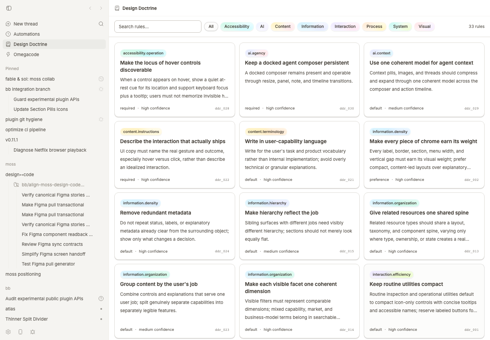

# Design Doctrine

Design Doctrine turns the product-design feedback you give in bb threads into versioned rules that agents browse and apply while they design, build, and critique. Reach for it when you want an agent's design choices to reflect your own judgment instead of generic defaults.



## Install

```bash
bb plugin install git:https://github.com/brsbl/bb-plugins.git@plugin/design-doctrine --yes
```

## Use

Open the **Design Doctrine** sidebar panel to browse rules, ask an agent to apply your doctrine, or query from the CLI:

```bash
bb doctrine search "<task and surface>"
bb doctrine show ddr_001
```

Each rule is an ordinary Markdown file under `rules/<domain>/`, so Git is its history and rollback. The bundled `design-doctrine` skill loads the rules as a judgment layer over normal design work — it does not replace product requirements, accessibility, or platform conventions.

**Where rules come from.** Every rule traces to concrete feedback you gave directly — something you asked for, corrected, approved, or rejected. Agent output never counts as evidence, and independent repetitions raise a rule's confidence. [`governance.md`](governance.md) defines the allowed evidence and rule changes.

**How rules stay current.** Design Doctrine is built to stay current on a schedule, not from passes you have to remember to run. A bb automation runs the same bounded evidence-to-rules pass on new history so your doctrine keeps tracking your feedback. Each run is checkpointed and safe to repeat: [`scripts/scan-history.py`](scripts/scan-history.py) reads new user messages through a saved cursor (by default at most 200 messages or 256 KiB), the agent makes at most five rule changes, validates tests, types, and the build, and commits only `rules/`. The pass refuses a dirty rules tree, holds a lease so two runs never process the same messages, and advances its cursor only after a commit or a verified no-change pass. [`maintenance/automation-prompt.md`](maintenance/automation-prompt.md) is the exact procedure a run follows; [`maintenance/bootstrap-prompt.md`](maintenance/bootstrap-prompt.md) sets up the recurring automation on a fork.

## Develop

From the monorepo root:

```bash
npm ci
npm run check --workspace=bb-plugin-design-doctrine
bb plugin install "path:$PWD/plugins/design-doctrine" --yes
```

**Adapt it to your own history.** [`maintenance/bootstrap-prompt.md`](maintenance/bootstrap-prompt.md) is one copy/paste prompt that forks the repo, seeds evidence from your bb threads, rebuilds `rules/` from your own feedback, and schedules the recurring refresh. To preview that evidence first, the shared reader emits best-effort-redacted, checkpointed history to inspect before you decide what anonymous signal to keep:

```bash
node ../../tooling/bb-history.mjs scan --state ./.bb-evidence-state.json --format jsonl
```

`scan-history.py` is Design Doctrine's own checkpointed reader over bb's local database (`~/.bb/bb.db`, overridable with `BB_DB_PATH` or `BB_DATA_DIR`) — every direct user message across your threads, not just this project. It and [`tooling/bb-history.mjs`](../../tooling/bb-history.mjs) share one cursor-and-lease contract; see [repository tooling](../../tooling/README.md).

See [import provenance](../../docs/provenance.md) for how this plugin entered the monorepo.
