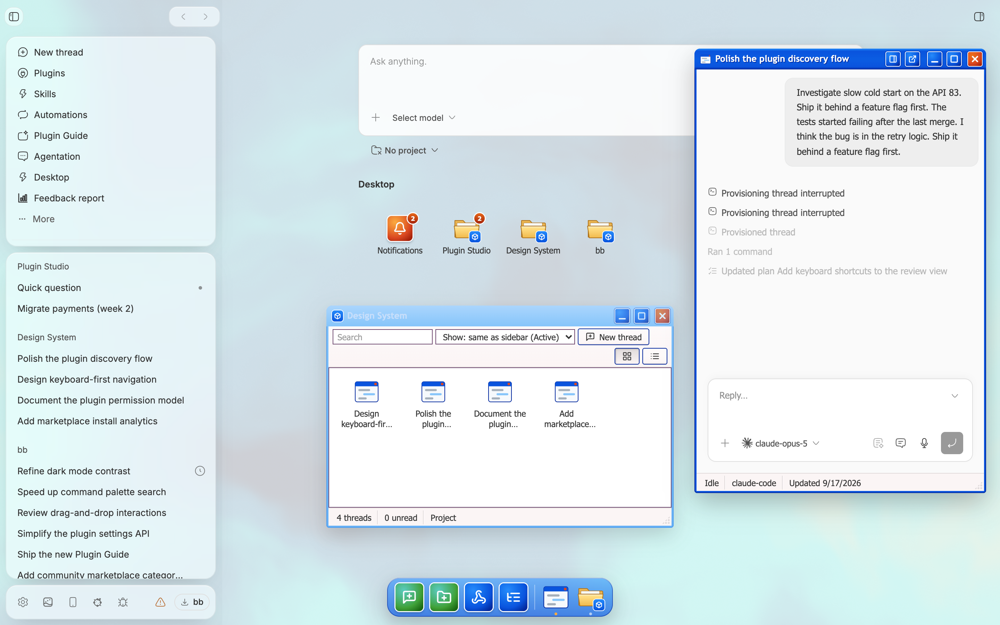

# Desktop

Desktop turns bb's new-thread page into an operating system for your agents. Threads live in folders and open in draggable windows. The page itself is the wallpaper, so it pairs well with the Ambient plugin.



## Use

- **Folders.** Desktop folders mirror the sidebar's organization: your sections plus the loose Threads bucket, your projects, or your machines. By default they follow the sidebar's own setting; change it by right-clicking the desktop. New folder creates either a real sidebar section or a desktop-only folder, and desktop-only folders can hide their threads from the sidebar.
- **More.** Groups you move into More in the sidebar live inside a More folder on the desktop instead of cluttering it. Its icon rolls up their status.
- **Which folder is this thread in?** The Threads window lists each thread's folders under its title, every thread's tooltip and details panel name its folders, and a thread page shows a folder label next to the sticky-note button when the thread is in a Desktop folder.
- **Recycle Bin.** Archived threads live in the Recycle Bin, and folders show only active threads. Drag a thread onto the bin to archive it; right-click it inside the bin to restore it, or drag it onto a folder. Dropping desktop folders or sections on the bin deletes them after a confirmation.
- **Selecting icons.** Drag across the desktop to select several icons, or Cmd/Ctrl/Shift-click to add and remove them. Drag any selected icon to move them together, press Delete to delete the selected folders and sections, and Cmd/Ctrl-A to select everything.
- **Finder.** Double-click a folder to open it. Switch between icon and list views, search, and drag threads between folders. Dropping a thread on a section folder moves it into that bb section.
- **Thread windows.** Double-click a thread to open it in its own window. Open as many as you like; drag them by the title bar, resize them from any edge, minimize to the taskbar, or double-click the title bar to maximize. The details button in each title bar opens that thread's side panel as a separate window beside it.
- **Taskbar.** An XP taskbar floats as a glassy pill at the bottom of the new-thread page, just wide enough for start, the clock, and a button per open window. The green **start** button opens the Start menu, which has New thread, New folder, Windows Media Player, Sticky note, and Turn Off Desktop. Each open window gets a taskbar button; click it to bring the window forward, or click again to minimize it. The tray shows the clock, plus the Media Player mini-player while music is playing.
- **Quick Launch.** Small launchers sit next to start: Show desktop, New thread, and Threads by default. Right-click the taskbar to choose from Show desktop, New thread, New folder, Threads, Recycle Bin, Windows Media Player, Sticky note, Plugins, and Skills; right-click a launcher to move it left or right. Show desktop minimizes every window, and a second click brings them back.
- **Needs-input balloon.** When a thread starts waiting for your input, a yellow XP balloon pops up from the tray clock, or from the bottom-right corner on thread pages. It names the thread; click to open it. Several waiting threads share one balloon. It hides after ten seconds or when dismissed, and returns only when another thread starts waiting. It never shows for the thread you're looking at.
- **Windows Media Player.** Press play to visualize your microphone with classic visualizations (Bars, Scope, and Ambience); use the arrows or double-click the screen to switch. Audio never leaves the browser, and pressing stop releases the microphone.
- **Desktop menu.** Right-click the desktop or any empty part of the new-thread page to set Organize by and Sort by, to Arrange icons into a grid, or to Tile windows, both in sort order.
- **Sticky notes.** Add one from the note button in a thread's header, the Start menu, or New sticky note in the desktop menu to place it where you clicked. Notes stay in the screen margins and follow you across every page, pinned to the nearer side. Drag the top strip to move, the corner to resize, the dot to change color, and × to delete (with Undo). Notes are saved on this device and hide when Desktop is off.
- **On/off.** The Desktop button in the sidebar footer turns the whole desktop on or off on this device. Turning it on takes you to the new-thread page. When it is off, the new-thread page shows no desktop, windows, or taskbar. The desktop, taskbar, and sticky notes never appear on phone-sized screens.

Agents and scripts can use the same features from the `bb desktop` CLI; see [the skill](skills/desktop/SKILL.md).

## Install

From this repository:

```bash
npm ci
bb plugin install "path:$PWD/plugins/desktop" --yes
```

## Develop

Run the focused package check from the repository root:

```bash
npm run check --workspace=bb-plugin-desktop
```
