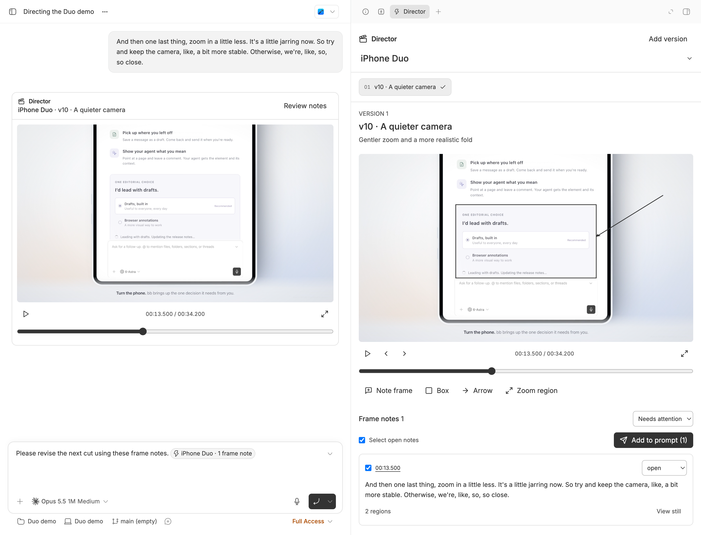

# Director

Review product films without leaving bb. Open a video, mark a paused frame, and hand precise feedback to the agent alongside the captured still. The Director thread panel keeps each demo's versions and unresolved notes together.



## Install

```bash
bb plugin install git:https://github.com/brsbl/bb-plugins.git@plugin/director --yes
```

Requires bb 0.43.4 or newer for composer mentions with image context. Uses only public Plugin SDK surfaces. Install `ffprobe` on the machine holding the videos to identify frame timestamps. H.264 MP4 is the most portable review format; MOV and WebM playback depends on browser codec support.

## Use

Open an `.mp4`, `.webm`, or `.mov` anywhere bb supports file viewers. Register it with a demo and version label to save feedback. The **Director** action in the thread's side-panel new-tab menu opens its version rail. Register new renders at distinct paths; Director references files in place and detects a registered file being overwritten.

Pause and choose **Note frame**, **Box**, **Arrow**, or **Zoom region**. Drag on the frame, type a note, and optionally drag a range end. ←/→ step one frame; space plays or pauses while the player is focused. Frame stepping uses probed timestamps, including variable frame rates; a supplied constant FPS is the fallback. Zoom regions mark desired focus; they do not alter the rendered film.

Select open notes and choose **Add to prompt**. A composer mention resolves to structured version/time/region feedback plus captured JPEG stills when sent. This preserves the existing draft and leaves sending to the user. Up to 12 notes fit one selection. Notes persist in plugin SQLite storage and sync across clients. Status can be **open**, **fixed**, **still wrong**, or **regressed**. Only unresolved statuses carry forward; copied notes preserve their original frame and version provenance.

Agents post a player using the returned directive, on its own line:

```text
::director{version="VERSION_ID"}
```

The bundled **Product Demo Direction** skill records grounded camera, pacing, liveness, physical-motion, rendering, audio, and delivery guidance. It tells agents to read open notes before revising and register every render.

### Tools and CLI

All commands return JSON and accept `--thread ID`; otherwise the CLI uses the active thread. Tool inputs accept `threadId`. Version and note lists return `nextOffset`; pass it as `offset` / `--offset` to continue.

| Agent tool | CLI | Inputs beyond the thread |
| --- | --- | --- |
| `director_register_version` | `bb director register` | `--demo`, `--file`, `--label`, optional `--summary`, `--fps`. |
| `director_versions` | `bb director versions` | Optional `--offset`. |
| `director_list_notes` | `bb director notes` | Optional `--version`, `--demo`, `--status`, `--actionable`, `--offset`. |
| `director_add_note` | `bb director add-note --data '<JSON>'` | Version, timestamp/range, shapes, text, captured still. |
| `director_update_note_status` | `bb director status` | `--note`, `--status`. |
| `director_context` | `bb director context --data '<JSON>'` | `noteIds`: up to 12 selected actionable notes. |
| `director_frame` | `bb director frame --note ID` | Returns the captured still. |
| `director_post_player` | `bb director post --version ID` | Returns the directive for the agent to emit in its reply. |

```bash
bb director register --demo "iPhone Duo" --file /absolute/demo-v10.mp4 --label v10 --summary "Gentler zoom; full composer"
bb director notes --version VERSION_ID --actionable
bb director status --note NOTE_ID --status "still wrong"
bb director post --version VERSION_ID
```

For `add-note`, supply `versionId`, `timestamp` (seconds), optional `endTime`, `text`, `shapes`, and `still: {dataUrl, width, height}`. Shapes have `kind` (`box`, `arrow`, `zoom`) and `x1`, `y1`, `x2`, `y2` normalized to 0–1 relative to the video frame. The still is a JPEG data URL, at most 350,000 characters. Tool `director_frame` returns a native image; CLI returns its data URL. `context` returns structured context and a saved selection ID used by the UI's composer mention. Neither CLI `post` nor `context` submits a chat message on the user's behalf.

### Later

Scene maps/storyboards, promoting a note to the direction skill, and render automation/dashboards.

## Develop

Use this repository's remote CI for typechecks, builds, and tests. For a dedicated development bb instance:

```bash
cd /absolute/path/to/bb-plugins
npm ci --workspace=bb-plugin-director --include-workspace-root --ignore-scripts
bb plugin install "path:$PWD/plugins/director" --yes
```

Point that instance's `bb` CLI at its own server. **Install dependencies in this checkout before installing its path.** bb builds the frontend for path installs but does not run npm for them; dependencies in a different checkout or bb's own `node_modules` do not count. The scoped command above prepares Director without installing every workspace or running native build scripts. A normal repository-wide `npm ci` also works. No separate local plugin build or production BB profile is needed.

The published `plugin/director` ref includes self-contained frontend, server, and host bundles. Its release manifest points at those bundles and has no npm dependencies. CI rebuilds that exact release layout outside the repository's dependency tree via Director's `test:built` script, independently of the catalog screenshot check.

The host entry reads video metadata with ffprobe and verifies file identity; it never renders, transcodes, copies, or modifies source videos. The backend streams HTTP byte ranges through public plugin HTTP and host RPC APIs, keeping reads to 256 KiB and avoiding the core file-preview size limit. It uses public `resolve().experimental_images` for image context. This additive mention field is documented in bb's public Plugin Guide; it is structurally compatible with this repository's pinned SDK declarations. The host minimum is scoped to Director.
