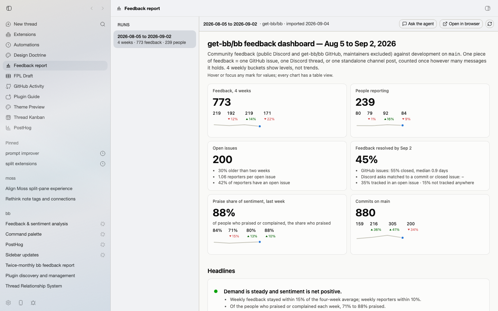

# Feedback Report

A rerunnable community feedback report for bb: public Discord and GitHub feedback for a chosen period, classified once, checked against what shipped, and rendered as a dashboard with a brief on top and the depth behind tabs. An agent thread can be opened from any run to ask follow-up questions.

## Use



1. An agent runs the bundled `feedback-report` skill for a period (`asOf`, `weeks`). The skill drives the scripts in `scripts/` in order: collect, prepare, GitHub state, commit ledger, classification batches read by parallel workers, a resolution check of every piece of feedback against commits and issues, `compute.mjs` for the data, a narrative written from the data, and `build-dashboard.mjs` for the HTML.
2. `bb feedback-report import <run-dir>` stores the run (report, narrative, dashboard) in the plugin database. The Feedback report panel shows the selected dashboard with five feedback cards in a row beneath Overview. Use **Runs** in the toolbar to expand or collapse the run list.
3. **Ask the agent** spawns one thread per run, primed with the run's headlines and `bb feedback-report show <runId>`, and reopens it afterwards.

The run directory layout and every metric definition are in [docs/run-contract.md](docs/run-contract.md). Narrative rules are in the skill's `references/narrative-guide.md`.

The dashboard's shared type, spacing, color, and component rules are in [docs/design-system.md](docs/design-system.md). Apply them when changing or generating its interface.

## Install

```
bb plugin install git:https://github.com/brsbl/bb-plugins.git@plugin/feedback-report --yes
```

The collector needs a Discord bot token with read access to the community server (set it in the plugin settings) and an authenticated `gh` CLI for GitHub.

## Settings

| Setting | Purpose |
| --- | --- |
| Project for follow-up threads | Where "Ask the agent" threads are created |
| GitHub repository | `owner/name` used for issues, PRs, and links |
| Discord guild id | The community server to collect from |
| Local checkout path | A checkout with `origin/main` for the commit ledger |
| Maintainer handles | Comma-separated GitHub logins and Discord usernames excluded from feedback |
| Discord bot token | Secret; read only by the collector |

## CLI

```
bb feedback-report runs
bb feedback-report show <runId>
bb feedback-report import <run-dir> [--machine <hostId>]
bb feedback-report remove <runId>
bb feedback-report latest
```

`import` reads the run directory on the machine that invoked the command (resolved from the calling thread), or on `--machine`.

## Develop

```
npm run typecheck
npm test
npm run build
```

Scripts are plain Node 22 ESM with no dependencies; `docs/run-contract.md` is their specification.
