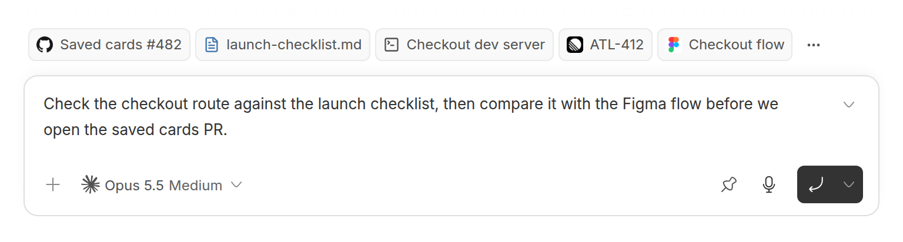
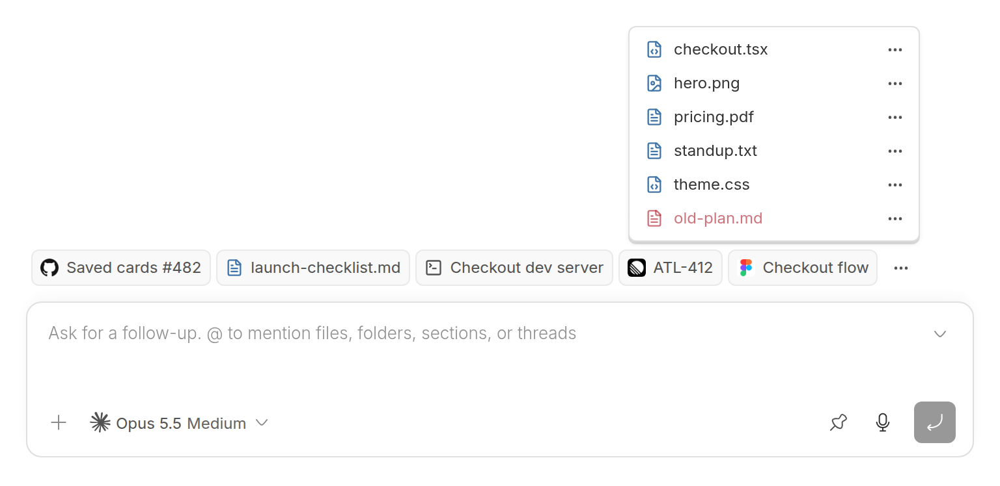
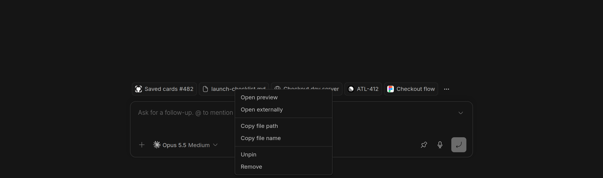
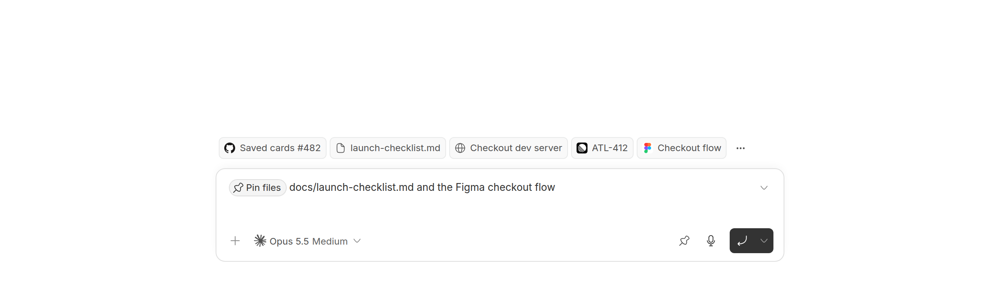

# Pinned Files & Links

Keep local files and web links within reach in each thread. Pins stay above the
composer even when the file viewer is closed, and are shared across clients.









## Install

```bash
bb plugin install git:https://github.com/brsbl/bb-plugins.git@plugin/file-pins --yes
```

## Use

Click the pin button in the composer's action row. It adds a **Pin** pill at the cursor;
type one or more paths, file names or URLs after it and send. The pill carries this plugin's
[skill](skills/file-pins/SKILL.md) to the agent, which finds each file (absolute, `~/`, or relative
to the workspace or the thread's files), asks about any that are ambiguous, pins them and any
http(s) links with `bb file-pins pin`, and confirms.

Agents also pin a thread's few key links without being asked: the PR they open or drive, the
issue or ticket, the spec or design doc, and a dev site or dashboard they hand you (a local dev or
story server, its BB Connect URL, or a deployed preview). Each gets a clear title; secret-bearing
URLs are never pinned, superseded links are replaced rather than piling up, and a dev site's pin is
removed when its server is retired. A short always-on instruction points every thread at the skill's rule.

Pinned files read as quiet raised chips above the composer, in order, as many as fit; the strip never
scrolls. Each chip is as wide as its label. With a mouse, labels truncate only when the strip runs out of
room, and pinned files that still don't fit lead the **⋯** list. On touch screens, which have no hover to
show a full label, pins keep their whole labels while they fit, the next pin fills what is left of the
row (shortened), and the rest go to **⋯**. Files that aren't pinned sit in the **⋯** list. File icons mark code, documents and images in the theme's file color. Hover or focus a pin for a small preview card: its URL or file path sits in a subtle header above the title and icon, with file availability and machine details when needed.
Right-click a strip file for **Open preview**, **Open externally**, **Copy file path** and
**Copy file name**, then **Unpin**. Compact menus use the same actions in the **⋯** list;
previously hidden items also offer **Pin** while the strip has room. **Unpin** removes the
item from the thread and offers **Undo**. Missing files keep their light red tint and
assistive labels, and their **×** also unpins them. Availability refreshes on focus and every
30 seconds.

Pinned links share the same menus and Undo behavior. Clicking a link follows bb's browser
preference; its menu offers **Open**, **Copy link**, and **Unpin**.

A thread without pins shows no strip; the pin button is always in the action row.

```bash
bb file-pins pin '~/Moss/Notes/Tweets/Tweets.md' --machine host_37m3sgpq59
bb file-pins pin https://github.com/brsbl/bb-plugins/pull/343 --title 'Quiet raised pins'
bb file-pins list --thread thr_example --json
bb file-pins remove <pin-id> --thread thr_example
```

`--thread` defaults to the current thread. The file host defaults to the invoking
thread's host, then the target thread's host. Relative CLI paths use the invoking
thread's directory only when it belongs to that same host. Duplicate paths on
the same host, and identical URLs, produce one pin; each thread supports 40 pins, files and links
together. Only `http` and `https` URLs without credentials can be pinned.

Paths resolve on the selected machine through the plugin's host entry. File
contents never enter pin storage. Pins survive reloads and thread environment
changes and can be removed while a machine is offline. Deleting the thread
removes its pins. Pinning does not send file content to the agent. Icons are looked up only for a
pinned link's public HTTPS origin, never its path or query, and cached in the plugin's database. For a
pinned GitHub pull request, the bb server sends the PR's owner, repository and number to GitHub's public
API, without credentials, and caches its state. GitHub answers only for public repositories, so a private
PR keeps the site icon unless it is the thread's own PR, whose state comes from bb. A rate limit from
GitHub pauses every lookup until it resets, and the last known state stays meanwhile.

A normal click on a pinned file follows bb's FileLink click behavior and opener
choices. Pin menus start with bb's open and copy items, then Pin/Unpin.
With [Moss Viewer](../moss-viewer) installed, a pinned Moss note opens in its panel, even when the
note lives on another machine, and **Open in Moss** there opens it for editing.

The pill is a plugin mention whose content is the shipped skill, read when the
message is sent, so the button and the agent share one set of instructions. Placing
it at the cursor needs bb 0.45 or later; older bb adds it at the end of the draft.

## Develop

Remote CI runs `npm run check --workspace=bb-plugin-file-pins`. For targeted UI
verification, build/install this package in an isolated bb development app.
