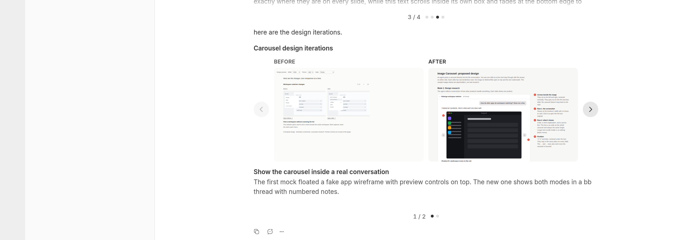

# Image Carousel

Show screenshots inline in a bb thread as a carousel, one slide at a time, with arrows on either side and the description below.



## Install

```bash
bb plugin install git:https://github.com/brsbl/bb-plugins.git@plugin/image-carousel --yes
```

## Use

Agents create a carousel with `bb image-carousel create` and put the `::image-carousel{id="…"}` directive it prints in their reply. The bundled skill covers when and how. There are two kinds:

- **research**: one image per slide with a title, description, and source link. For comparing how other products handle a design problem.
- **before-after**: Before and After shown side by side, with one shared title and description, advancing a pair at a time. For reviewing UI changes without a long screenshot table.

The text area spans the full width and has a fixed height. Longer descriptions scroll inside it, so the arrows and the "2 / 5" position stay in place as you move between slides. Every image sits in the same 16:10 frame. Click an image to open the full-size original. Arrow keys work when the carousel has focus. In narrow panels, After stacks below Before.

Images are read from the thread's machine and copied into the plugin's own database when the carousel is created. A carousel keeps working after its source files, worktree, or thread are cleaned up, and in forks of the thread. `bb image-carousel remove <id>` deletes it, along with any image copies no other carousel uses.

## Develop

From the monorepo root:

```bash
npm ci
npm run check --workspace=bb-plugin-image-carousel
bb plugin install "path:$PWD/plugins/image-carousel" --yes
```
