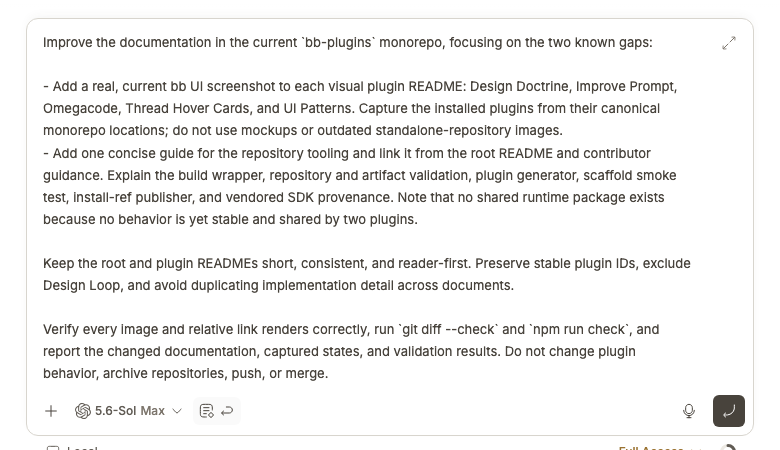

# Improve Prompt

Improve Prompt rewrites a rough bb composer draft into a concise, context-complete request without sending it.



## Install

```bash
bb plugin install git:https://github.com/brsbl/bb-plugins.git@plugin/improve-prompt --yes
```

## Use

Write a draft, choose **Improve prompt**, review the replacement, and send when ready. Attachments remain attached, and the text change can be undone.

While the rewrite is running, the composer is locked to prevent conflicting edits, the draft uses Improve Prompt's own shimmer treatment, and the same action becomes an accessible cancellation control. Cancelling aborts the client operation and stops the helper request; successful replacement restores focus to the composer.

The behavior comes from the installed `prompt-shaper` skill; the stable plugin ID remains `prompt-shaper` for compatibility.

The UI is registered through `app.composer.customize(...)` as the `improve` composer action. Its component uses the context-bound `useComposer()` and `useComposerView()` hooks, so thread, queued-message, side-chat, and new-thread drafts are handled by their mounted composer instance.

## Develop

From the monorepo root:

```bash
npm ci
npm run check --workspace=bb-plugin-prompt-shaper
bb plugin install "path:$PWD/plugins/improve-prompt" --yes
```
