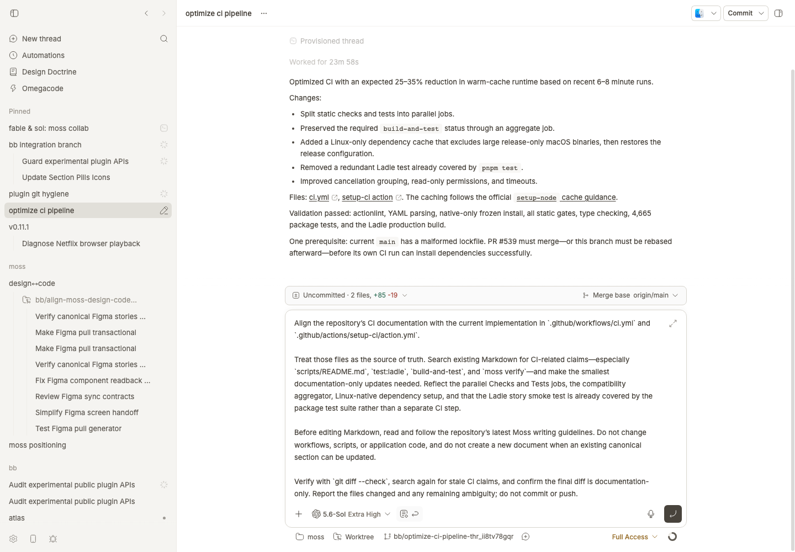

# Improve Prompt

Improve Prompt gives a rough bb composer draft one focused editing pass. It returns a clearer, context-complete request for you to review, without sending anything.




## Install

```bash
bb plugin install git:https://github.com/brsbl/bb-plugins.git@plugin/improve-prompt --yes
```

## Use

Write as roughly as you like, then choose **Improve prompt**. The revised text comes back in place for review; attachments stay attached, and you can undo the change.

## How it was built

Two pieces make the experience work. The runtime plugin handles the composer action, helper thread, progress, result insertion, and undo. The [`prompt-shaper` skill](skills/prompt-shaper/SKILL.md) decides how to improve the draft, using the current thread and linked context each time.

The skill's guidance comes from prompt and handoff problems that showed up repeatedly in bb threads: missing context, fuzzy scope, unnecessary detail, and no clear stopping point.

## Develop

From the monorepo root:

```bash
npm ci
npm run check --workspace=bb-plugin-prompt-shaper
bb plugin install "path:$PWD/plugins/improve-prompt" --yes
```
