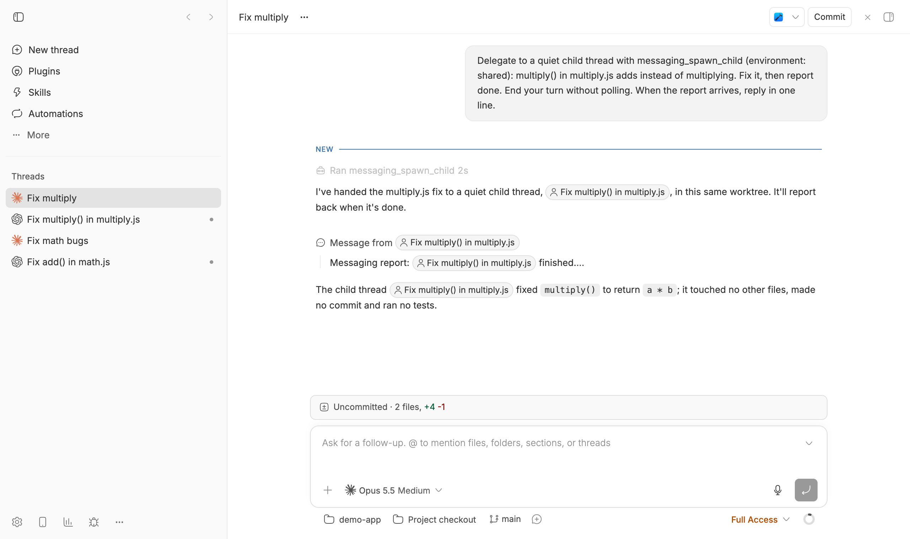

# Messaging

Child threads that report to their parent only when they finish, get blocked, or need a decision.

Native bb children wake their parent after every turn, including follow-ups
and acknowledgements. Messaging children stay quiet: routine progress stays in
the child, and the parent hears from it only through an explicit report or
when the child fails or waits on an approval.



## Install

```bash
bb plugin install git:https://github.com/brsbl/bb-plugins.git@plugin/messaging --yes
```

## Use

Ask an agent to delegate work to a quiet child thread, or run the commands
from inside a thread:

| Command | Agent tool | Result |
| --- | --- | --- |
| `bb messaging spawn "<task>"` | `messaging_spawn_child` | Starts a child on the parent's provider, in the project's default environment or the parent's with `--environment shared`. |
| `bb messaging report <kind> '<message>'` | `messaging_report_to_parent` | Sends one `done`, `blocked`, `decision`, or `status` report to the parent. |
| `bb messaging children` | `messaging_list_children` | Lists children with their status and last report. |
| `bb messaging request-status <child>` | `messaging_request_status` | Asks a child for a status report. |

Messages travel over bb's own thread messaging, so reports appear in the
parent as `[bb message from thread:…]`. Use `bb thread tell` for anything
else. Archiving the parent archives its Messaging children.

## Tradeoffs

- bb's native Parent field stays empty, so core child-thread views and sidebar
  nesting do not show Messaging children.
- Completion reporting relies on the child following its instructions.
  `bb messaging children` shows idle children that never reported.

## Develop

From the monorepo root:

```bash
npm ci
npm run check --workspace=bb-plugin-messaging
bb plugin install "path:$PWD/plugins/messaging" --yes
```
