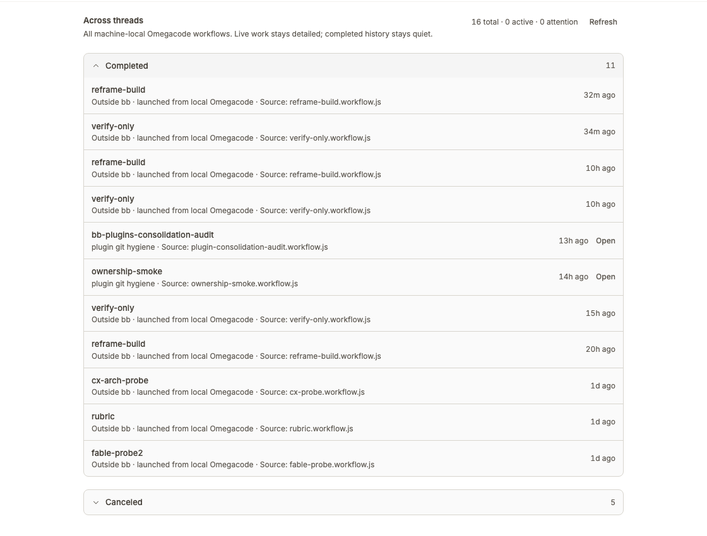

# Omegacode

Omegacode shows every local workflow on one bb plugin page and live owner-scoped progress above the composer that launched each run.



## Install

```bash
bb plugin install git:https://github.com/brsbl/bb-plugins.git@plugin/omegacode --yes
```

## Use

Open Omegacode from the bb sidebar to scan workflows across threads and jump to an owning thread. A compact banner also appears only above the composer that launched an active run. Use `bb omegacode status`; add `--all` for the machine-wide CLI view.

Runs must record `BB_THREAD_ID` and `BB_ENVIRONMENT_ID` to appear in an owning composer. Journals without that context remain visible only on the global page and in the explicit `--all` CLI view.

## Develop

From the monorepo root:

```bash
npm ci
npm run check --workspace=bb-plugin-omega
bb plugin install "path:$PWD/plugins/omegacode" --yes
```
