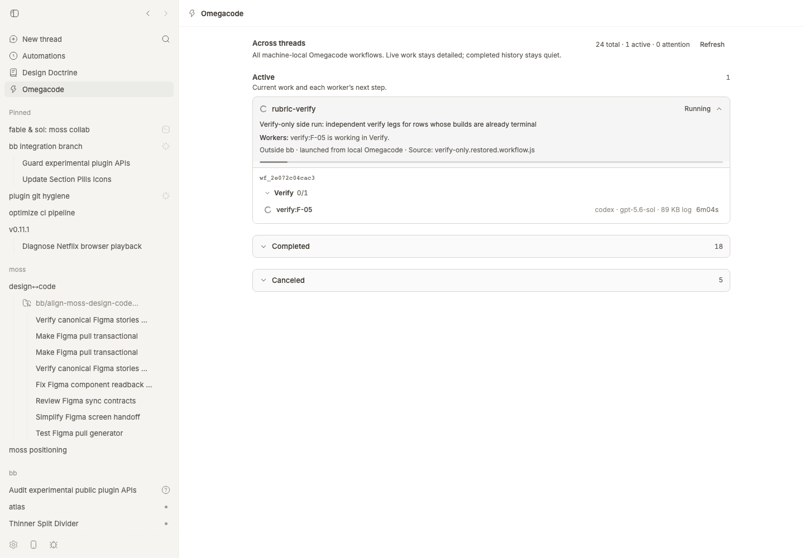
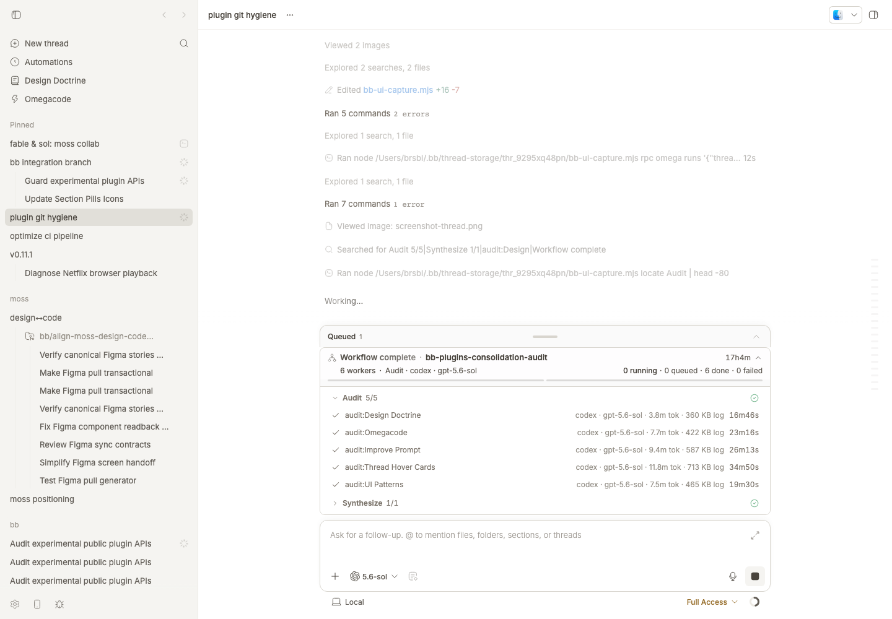

# Omegacode

[Omegacode](https://github.com/SawyerHood/omegacode) is the underlying agent-workflow runner. This bb plugin shows its machine-local runs on one page and the current thread's owned run above the composer.





## Install

```bash
bb plugin install git:https://github.com/brsbl/bb-plugins.git@plugin/omegacode --yes
```

## Use

Open Omegacode from the bb sidebar to scan workflows across threads and jump to an owning thread. From the CLI, `bb omegacode status` shows the current thread's run; add `--all` for the machine-wide view.

## How it was built

The plugin reads Omegacode's append-only `journal.jsonl` and `events.jsonl` files under `~/.omegacode/runs`; it does not implement the workflow runner. The global page summarizes every local journal, while the compact composer status requires matching `bbContext.threadId` and `bbContext.environmentId` metadata.

The owner-scoped surface is built around a strict runner contract: journals with both bb identifiers can belong to one composer, while journals without them remain global-only. Matching and presentation logic live in `ownership.ts` and `presentation.ts` with focused tests.

See [repository provenance](../../docs/provenance.md) for attribution and import history.

## Develop

From the monorepo root:

```bash
npm ci
npm run check --workspace=bb-plugin-omega
bb plugin install "path:$PWD/plugins/omegacode" --yes
```
