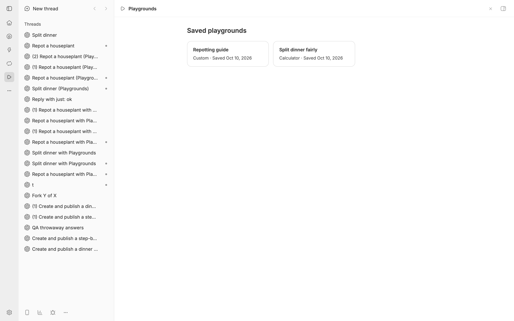

# Playgrounds

Answers you can play with: calculators, guides, previews. Agents put a
playground right in their message, built from native controls or a custom HTML
interface, and changing an input updates it immediately without another model
call.

## Install

Requires bb 0.46 or newer.

```bash
bb plugin install git:https://github.com/brsbl/bb-plugins.git@plugin/playgrounds --yes
```

If you used the earlier Interactive Answers plugin, uninstall it first
(`bb plugin uninstall interactive-answers`). Both register the same commands,
and answers it published use its old directive, so they stay as plain text.

## Save playgrounds for later



Choose **Save to library** under any playground to keep it, with its current
inputs, in your own library. Saved playgrounds are private to you; there is no
sharing. Open **Playgrounds** in the sidebar to use, rename, or remove them.
To bring one back into a conversation, @-mention it in the composer, or ask the
agent to run `bb playgrounds publish --saved <savedId>`.

```bash
bb playgrounds save <id> --title "Dinner split"
bb playgrounds saved
bb playgrounds publish --saved <savedId>
bb playgrounds rename-saved <savedId> --title "New name"
bb playgrounds unsave <savedId>
```

A saved playground has its own inputs, so using it in the library or in a new
thread doesn't change the original, and it stays saved after the thread it came
from is deleted.

## Use

Ask for a calculator, scenario comparison, or interactive explanation. The
plugin gives agents a `playground` tool, a document guide, examples,
and the `playgrounds` skill. Native documents can include number
fields, sliders, choices, live metrics, line and bar charts, tables, text,
expandable explanations, and interactive vector diagrams. Every chart also has
a data table.

```bash
bb playgrounds guide
bb playgrounds example bill | bb playgrounds publish --document-stdin
bb playgrounds example stepper | bb playgrounds publish --playground-stdin
```

Emit the returned `::playground{id="…"}` directive on its own line in
an assistant message.

Inputs are saved with each playground on the bb server, so they follow you across
devices and every open copy updates live. Inputs are context the agent can
read, never approvals. Published playgrounds are immutable; a revised playground gets
a new ID. Playgrounds, their state, and their event logs are stored in the plugin
database, scoped to their thread, and removed when that thread is deleted.
Forking a thread copies its playgrounds, inputs included, into the fork. The copy
is independent: changing it doesn't change the original, and deleting the
original doesn't affect it. A side chat is part of its thread's conversation,
so it shows the same live playground as the thread.

## Agents can drive playgrounds

```sh
bb playgrounds state <id>
bb playgrounds watch <id> --since 0 --wait 20
bb playgrounds actions <id>
bb playgrounds do <id> set --args '{"people": 6}'
```

Native documents expose `set` and `reset`. HTML playgrounds expose their own
actions with `window.playground.expose()`. `window.playground.send()` attaches data to
the user's next message as a pill. Commands run in the most recently used copy that offers the action, and the
card shows "Agent · <action>" each time the agent acts. Output that comes from
a playground's scripts is wrapped in `<playground-data>` so agents treat it as
data.

## HTML playgrounds

HTML playgrounds are served from the plugin's `/frame` route and rendered in an
`<iframe sandbox="allow-scripts">`, so scripts run in an opaque origin with no
access to bb, its cookies, or the conversation. The route's
Content-Security-Policy also blocks the network: `default-src 'none'`, inline
scripts and styles only, `connect-src 'none'`, `form-action 'none'`,
`base-uri 'none'`, and images only from `data:`, `blob:`, and
`https://upload.wikimedia.org`. A playground cannot send what you type anywhere,
and viewing one contacts no third party except Wikimedia for photos it shows.

The frame talks to bb only through `postMessage`, and bb accepts messages only
from that frame's window:

- Web links and `window.playground.send()` take effect only while the frame has
  focus and a fresh user activation, at most once per second, so a playground
  cannot open tabs or insert composer pills while you type elsewhere. Links
  open through bb's URL handling and only for `http` and `https`.
- Events and action lists are rate limited per frame. State, events, command
  results, and shared data are size limited on the server.
- bb hands the frame the Inter font it already loaded, so playgrounds make no
  third-party font request.
- Height is clamped to 4,000 px, frames load lazily, and data shared with the
  agent is framed as untrusted.

## Develop

```bash
npm ci
npm run check --workspace=bb-plugin-playgrounds
```

Playgrounds needs plugin SDK 0.6.37, newer than this repository's shared pin,
so it carries its own SDK archive and provenance in `vendor/`. Run checks in
remote CI. For local interaction verification, install the plugin only into an
isolated source dev app.
