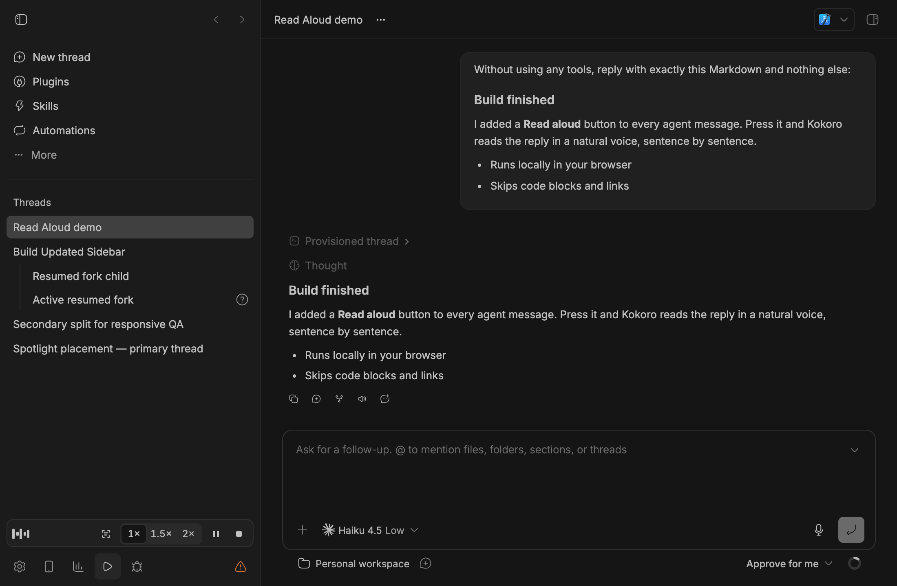

# Read Aloud

Read agent messages aloud with [Kokoro](https://huggingface.co/hexgrad/Kokoro-82M) text-to-speech running on your bb server.



## Install

```bash
bb plugin install git:https://github.com/brsbl/bb-plugins.git@plugin/read-aloud --yes
```

## Use

- Press **Read aloud** (▶) in a message's action bar. Press it again, or ■ in the controls, to stop.
- Highlight text in an agent message and choose **Read aloud** to hear only the selection.
- While reading, compact controls open above the sidebar footer: a soundwave showing the reading state, a button that jumps to the message being read, **1×** / **1.5×** / **2×**, pause/resume, and stop. Each device remembers its speed.
- The footer's ▶ button collapses the controls and pauses; pressing it again expands them and resumes. Pressing **Read aloud** on a paused message also resumes.
- On bb versions without footer items, the controls appear in a small toast without pause.
- Code blocks, URLs, and Markdown syntax are skipped so the reading sounds like prose.

Speech is synthesized on the bb server and streamed to whatever device you're using, including phones. Devices never download the model. The server synthesizes a short first phrase so audio starts within a couple of seconds, and fetches the rest ahead of playback. A new reading's first phrase jumps the queue. If the server is still computing audio you abandoned, a warm standby process takes over at once.

## Server setup

The first time the plugin loads, it prepares Kokoro on the bb server, which takes a few minutes. The server then keeps the voice loaded, so readings start right away.

- **Runtime install:** `npm ci` installs the pinned runtime from `runtime/runtime-lock.json` into the plugin's data directory. That's about 700 MB, and it's reinstalled only when the lockfile changes.
- **Voices:** all 28 Kokoro voices come bundled in that runtime.
- **Model:** the fp32 weights (about 330 MB) are downloaded once from a pinned Hugging Face commit.
- **Memory:** synthesis runs in separate, low-priority processes: one active and one warm standby, about 1 GB each.

## Settings

| Setting | Default | Purpose |
| --- | --- | --- |
| Voice | `af_heart` | Any Kokoro v1.0 English voice (`a*` American, `b*` British). |

```bash
bb plugin config read-aloud set voice bm_george
```

## Develop

From the monorepo root:

```bash
npm ci
npm run check --workspace=bb-plugin-read-aloud
```
