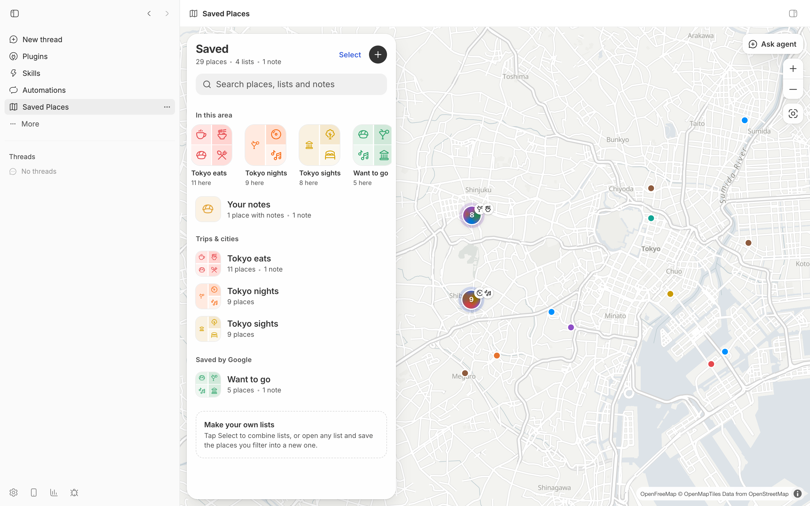

# Saved Places

Your saved places on a map that gets clearer as you zoom. Browse lists, build your own, leave notes, see what's within a 5/10/15-minute walk, plan a route, and hand the current map view to an agent with **Ask agent**.

It ships with a small sample of public places in Tokyo. Import your own Google Maps lists or any CSV to make it yours.



## Install

```bash
bb plugin install git:https://github.com/brsbl/bb-plugins.git@plugin/saved-places --yes
```

Requires bb 0.43 or newer. The published build contains the sample data; install from source to use your own places.

## Use

Open Saved Places from a thread's panel menu or the sidebar.

- **Library.** Lists, custom lists, and notes, each with a cover. Search matches places, lists, and notes.
- **Lists.** Category chips, an "Only in view" filter, and a map chip with the in-view count.
- **Custom lists.** Build a list from one or more lists, the current filter, or what's in view.
- **Notes.** A short note on any place; notes show on rows, pins, and clusters.
- **Walking reach.** 5/10/15-minute walking rings around a place, with everything outside dimmed.
- **Routes.** Add stops, pick walk, bike, or drive, find the quickest order, and open it in Google Maps.
- **Ask agent.** Opens a new-thread draft with a snapshot of the current map view (camera, filters, places in view, notes) attached as a mention. Add your question and send it to start the agent.

Agents can read the same data with `bb saved-places list|collections|lists|notes --json`.

## Use your own places

Custom lists and notes live in bb's plugin storage. Places come from `data/saved-places.json`, which is gitignored; the first build copies `data/sample.json` there.

1. Clone the source repository and enter its root (Node.js 22.12 or newer is required):

   ```bash
   git clone https://github.com/brsbl/bb-plugins.git
   cd bb-plugins
   npm ci
   ```

2. Export your lists from [Google Takeout](https://takeout.google.com) by selecting **Saved** (lists as CSV) and **Maps (your places)** (starred places as `Saved Places.json`).
3. Import them from the repository root, one list per file:

   ```bash
   npm run import --workspace=bb-plugin-saved-places -- --geocode \
     "$HOME/Downloads/Takeout/Saved/"*.csv \
     "$HOME/Downloads/Takeout/Maps (your places)/Saved Places.json"
   ```

4. Build and install from source (see [Develop](#develop)). If you installed the published sample first, follow the source-switch instructions there.

Use absolute input paths: npm runs the importer from `plugins/saved-places`, so relative paths resolve there, not at the repository root. Use `"$HOME/..."` for quoted home-directory paths; `"~/..."` does not expand. Omit inputs you did not export.

Every import replaces the imported dataset; include all files you want to keep in the same command. Rebuild and reinstall after every import.

Takeout list CSVs contain names and links but no coordinates, so `--geocode` looks them up with [OpenStreetMap Nominatim](https://nominatim.org/release-docs/latest/api/Search/) at one request per second and caches the results in `data/.geocode-cache.json`. Places it can't find are skipped and listed.

Any CSV with `name`, `latitude`, and `longitude` columns also works, with optional `address`, `url`, `list`, `category`, and `type` columns. A `list` column splits one file into several lists. GeoJSON `FeatureCollection` files of Point features work too: coordinates are `[longitude, latitude]`, and `properties.name` supplies the place name. Optional `properties.list` and `properties.category` work like their CSV columns.

For example, from the repository root:

```bash
npm run import --workspace=bb-plugin-saved-places -- \
  "$HOME/Downloads/places.csv" "$HOME/Downloads/places.geojson"
```

```csv
name,latitude,longitude,list,category
Louvre Museum,48.8606,2.3376,Paris museums,culture
Luxembourg Gardens,48.8462,2.3372,Paris parks,outdoors
```

### Customize categories and grouping

All paths below are relative to `plugins/saved-places`.

- To rename a category, change its label in `categories.ts`; for example, change the `culture` label from "Sights" to "Landmarks". Keep its ID to preserve existing imports.
- To change automatic classification, edit `CATEGORY_RULES` in `scripts/import.mjs`, then re-import. An explicit recognized `category` column takes precedence over those rules.
- To add an ID, update `categoryIdSchema` and `categories` in `categories.ts`, `categoryIcons` in `category-icons.ts`, and both `known` and `CATEGORY_RULES` in `scripts/import.mjs`. Update the category list in `skills/saved-places/SKILL.md` too. Otherwise an explicit CSV category can silently fall back to automatic classification.
- To change library grouping, edit `groupFor` in `model.ts`. The IDs in `SYSTEM_LISTS` go under "Saved by Google"; titles containing "recommendations" go under "From friends"; other imported lists go under "Trips & cities". For example, extend `/recommendations/i` to `/recommendations|paris museums/i` to move that list under "From friends".

Run the [Develop](#develop) check and reinstall after your changes. Re-importing alone does not update the installed plugin.

## Map services

The map uses free, keyless services. Check their usage policies before heavy use.

| Service | Used for | Change it in |
| --- | --- | --- |
| [OpenFreeMap](https://openfreemap.org) | Basemap tiles | `basemap.ts` |
| [Valhalla](https://valhalla1.openstreetmap.de) public server (FOSSGIS) | Walking rings, travel times, routes | `ENDPOINT` in `routing.ts` |

Point `ENDPOINT` at your own [Valhalla](https://github.com/valhalla/valhalla) instance for heavier routing. Map data © OpenStreetMap contributors.

## Develop

From the cloned monorepo root:

If Saved Places is already installed from the published `git:` source, the first `path:` install will be rejected. Before switching sources, copy any notes and custom-list data you want to retain with `bb saved-places notes --json` and `bb saved-places lists --json`; plugin removal deletes settings, secrets, and schedules. Then remove the published install:

```bash
bb plugin remove saved-places
```

Skip removal on a first installation or when reinstalling the same local path. Then:

```bash
npm ci
npm run check --workspace=bb-plugin-saved-places
bb plugin install "path:$PWD/plugins/saved-places" --yes
```

The check runs typechecking, builds the plugin, and runs its tests. Re-running the final install command reloads the local build; reopen Saved Places to see the imported data.
