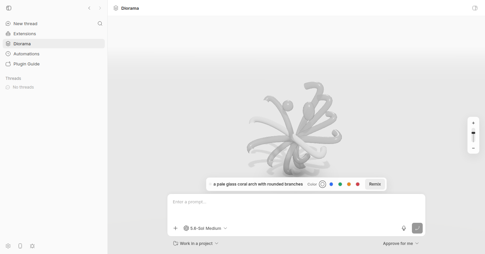

# Diorama

Diorama turns a prompt into one persistent interactive Three.js scene.
Send an idea from bb's composer and a hidden bb agent replaces the canvas with
its bounded, dimensional interpretation.



## Install

```bash
bb plugin install git:https://github.com/brsbl/bb-plugins.git@plugin/sceneseed --yes
```

Open **Diorama** in bb's navigation, enter a prompt, and send it. Diorama
creates its persistent canvas automatically, shimmers while the interpretation
runs, and replaces the current scene when the next prompt completes.

## Use

- Enter a prompt in bb's composer and send it. A failed interpretation offers
  an in-place retry.
- The first result fills the canvas. Each later prompt replaces it after a
  canvas-wide loading shimmer.
- Orbit or zoom the stage, apply a color tint, or remix the current scene.
  Diorama restores the persistent scene across reloads.

## Agent access

Scene generation uses agent-authored Three.js. When the user sends a prompt,
Diorama supplies a focused template with `THREE` already in scope. The agent
returns a JavaScript function body that constructs and returns one
`THREE.Object3D`; Diorama runs that source for the requested job, normalizes
the result to grayscale, recenters and grounds it, fits it into renderer
limits, serializes the Three.js object, and persists the rendered result.

The browser never evaluates returned source: it receives the serialized
Three.js object and loads it into the existing canvas renderer. This flow uses
the plugin's existing agent tool and bb SDK surface. Previously saved
`SceneObjectV1` records and older in-flight declarative submissions remain
accepted for compatibility.

The same saved records are available through the plugin CLI:

```bash
bb sceneseed list
bb sceneseed show <canvas-id> --json
bb sceneseed add <canvas-id> --prompt "a storm in a teacup" --x 0 --y 0
bb sceneseed wait <job-id>
bb sceneseed cancel <job-id>
bb sceneseed remove-object <canvas-id> <object-id>
```

## Safety and privacy

- Three.js source runs only for the prompt action the user submitted. It has
  the supplied `THREE` namespace and must return one finite object; imports,
  URLs, files, remote assets, textures, shaders, DOM, and network access are
  not part of the template.
- Prompts, generated scene graphs, transforms, job state, and canvas metadata are
  stored in the plugin's private SQLite database, not in a project workspace.
- The canvas uses a hidden, persistent bb thread in the personal project. The
  thread uses the normal provider and bb capability envelope; Diorama asks it
  not to inspect unrelated context, but does not claim structural isolation.
- Disabling or uninstalling the plugin does not erase its database or spawned
  threads. Use **Delete Diorama data** in Diorama settings to archive the
  interpreter thread and clear stored data, including legacy canvases.

## MVP limits

Only one prompt can generate at a time. The persisted data contract retains its
existing 25-object and 100-unit safety ceilings for backward compatibility.
Sharing, export, collaboration, raw mesh editing, remote model loading, and
image generation are intentionally out of scope.

`fixtures/prompt-scenes.json` is the fixed 32-prompt evaluation set for future
agent-quality runs: eight literal, metaphorical, spatial, and abstract prompts,
each with nearby-scene context and observable interpretation cues. It is test
data, not bundled executable content.

## Develop

From the repository root:

```bash
npm ci
npm run check --workspace=bb-plugin-sceneseed
bb plugin install "path:$PWD/plugins/sceneseed" --yes
```
