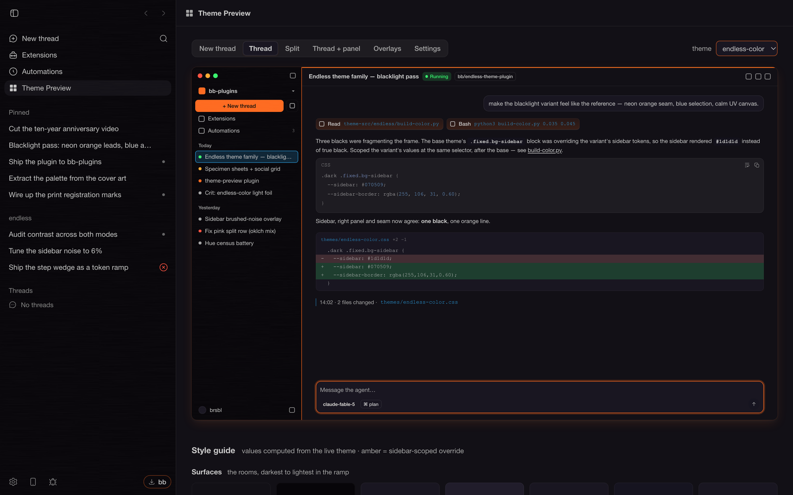

# Theme Preview

A skeleton of the bb app in every configuration — sidebar, splits, side panels,
overlays, real thread timelines and controls — drawn from the active theme's
tokens, so a palette can be judged on app-shaped surfaces before it ships.



## Install

```sh
bb plugin install git:https://github.com/brsbl/bb-plugins.git@plugin/theme-preview --yes
```

## Use

Open **Theme Preview** from the sidebar. The top of the page is one large app
skeleton; switch views with the segmented control to pan through the common
surfaces — **New thread · Thread · Split · Thread + panel · Overlays ·
Settings**. Below it sits a compact style guide: surfaces, ink on canvas and on
the sidebar, accent and status, lines, controls, sidebar row states, menus and
message surfaces — every value computed from the live theme.

Switch themes from the select at the top right; the whole app follows. Deep-link
a view with `/plugins/theme-preview/preview/<new|thread|split|panel|overlays|settings>`.

## Develop

```sh
npm install
npm run check   # typecheck, build, test
bb plugin install "path:$PWD" --yes
```

The preview reads CSS custom properties directly (`var(--sidebar)`,
`var(--surface-selected)`, …) rather than Tailwind classes, so it renders the
same under any host build.
