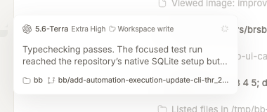

# Thread Hover Cards

Thread Hover Cards previews a sidebar thread's status, latest agent message, execution context, repository, and pull request without opening the thread.



## Install

```bash
bb plugin install git:https://github.com/brsbl/bb-plugins.git@plugin/thread-hover-cards --yes
```

## Use

Hover or keyboard-focus a thread row in the bb sidebar. The card appears beside the row without changing the active thread.

## How it was built

A server RPC computes a bounded thread summary on demand. The frontend attaches that summary to bb's `data-sidebar-thread-id` row attribute and positions the card beside the matching sidebar item.

The bridge exists because the current Plugin SDK has no thread-row hover slot. The DOM anchor is intentionally small and covered by focused behavior tests so a sidebar markup change has one clear integration point.

See [repository provenance](../../docs/provenance.md) for the standalone source and import revision.

## Develop

From the monorepo root:

```bash
npm ci
npm run check --workspace=bb-plugin-thread-hover-cards
bb plugin install "path:$PWD/plugins/thread-hover-cards" --yes
```
