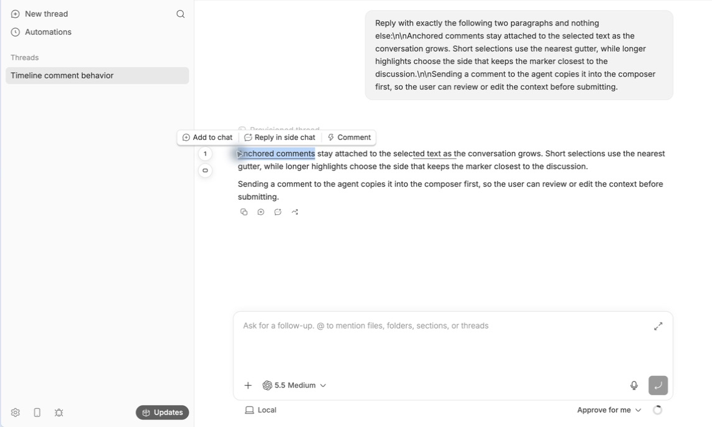
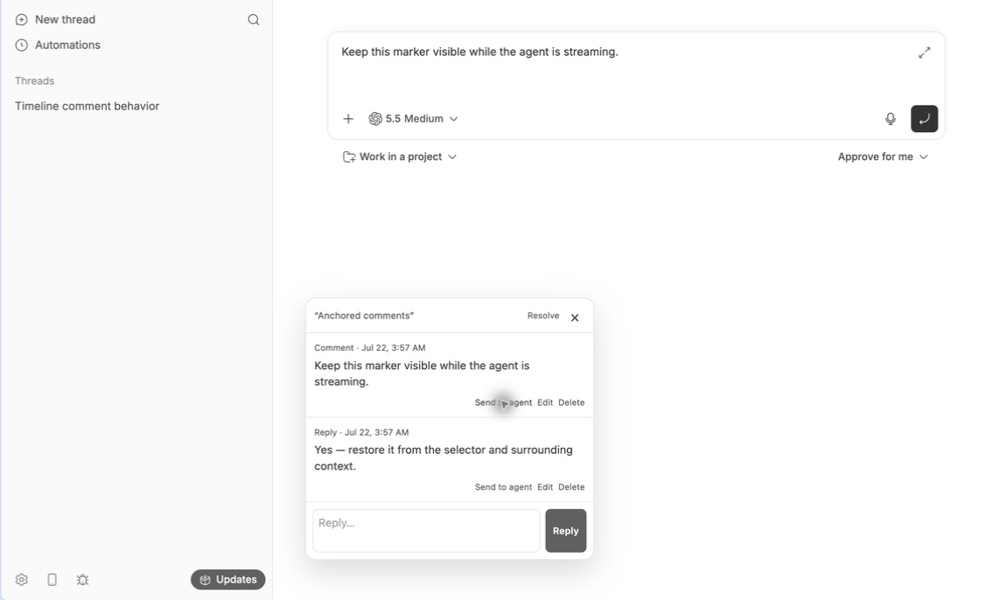

# Timeline Comments

Timeline Comments keeps review notes attached to the exact part of a bb conversation they refer to.

## Screenshots

Select message text to add a comment without leaving the timeline.



Comments stay attached through an underline and a compact nearest-gutter thread.


**Send to agent** opens a fresh thread composer with the comment ready to edit.



## Use

- Adds **Comment** to the floating menu when you select user or agent message text.
- Keeps open comment threads visible through a quiet underline and the nearest gutter marker.
- Provides replies, inline editing, deletion, resolve/reopen controls, and a thread-scoped Comments panel.
- Sends one comment to a new agent draft or adds every open comment to the current thread's draft without submitting it.

Comments are stored in plugin-owned SQLite on the bb server. Missing or ambiguous source text remains manageable as **Unanchored** and is never attached to a guess.

## Install

```bash
bb plugin install git:https://github.com/brsbl/bb-plugins.git@plugin/timeline-comments --yes
```

Timeline Comments requires bb 0.0.34 or newer and the 0.4 plugin SDK.

## Develop

From the repository root:

```bash
npm ci
npm run check --workspace=bb-plugin-timeline-comments
npm run test:browser --workspace=bb-plugin-timeline-comments
bb plugin install "path:$PWD/plugins/timeline-comments" --yes
```
