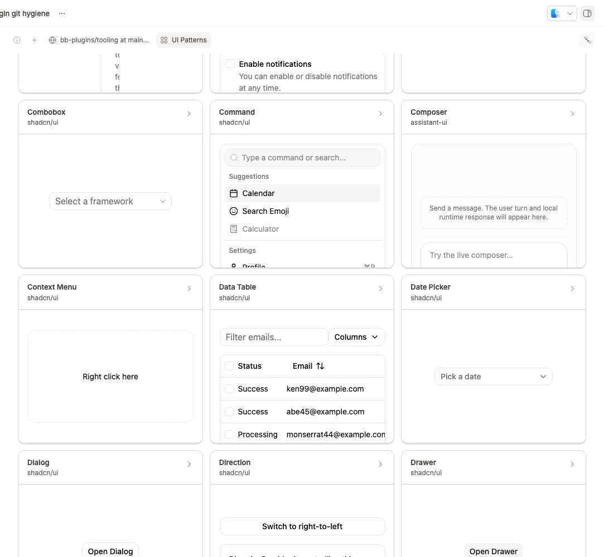

# UI Patterns

UI Patterns is a visual and agent-queryable browser for approved-source UI components and interaction guidance. Use it to choose, compare, or cite an established pattern by its real name instead of reinventing one.



## Install

```bash
bb plugin install git:https://github.com/brsbl/bb-plugins.git@plugin/ui-patterns --yes
```

## Use

Open the thread panel to browse the focused visual gallery, or query the full Atlas from the agent side:

```bash
bb ui-patterns search "<term>" --json
bb ui-patterns show <source-id>
```

The bundled `ui-pattern-atlas` skill lets agents pull vocabulary and attributed guidance; the gallery stays small while the full four-source Atlas remains available to search and agents.

**Where content comes from.** The Atlas is assembled only from pinned, approved revisions of shadcn/ui, Base UI, assistant-ui, and the WAI-ARIA Authoring Practices Guide. [`providers/upstreams.json`](providers/upstreams.json) records each repository, revision, allowed source paths, license, and attribution notice, and that attribution flows into the generated output. The plugin never fetches provider data at runtime.

**Maintenance model.** Maintained by hand against those pinned, approved revisions. Update a pin, then regenerate: `npm run update:providers` refreshes normalized source records and lock hashes, the build regenerates the snapshot, index, and preview CSS, and `check:providers` fails on drift. This plugin is marked experimental.

## Develop

From the monorepo root:

```bash
npm ci
npm run check --workspace=bb-plugin-ui-patterns
bb plugin install "path:$PWD/plugins/ui-patterns" --yes
```

**Adapt it.** Fork the repo, change an approved pin in [`providers/upstreams.json`](providers/upstreams.json) (or add a source adapter under `providers/`), then run `npm run update:providers --workspace=bb-plugin-ui-patterns` and rebuild. `check:providers` guards against snapshot drift.

See [import provenance](../../docs/provenance.md).
