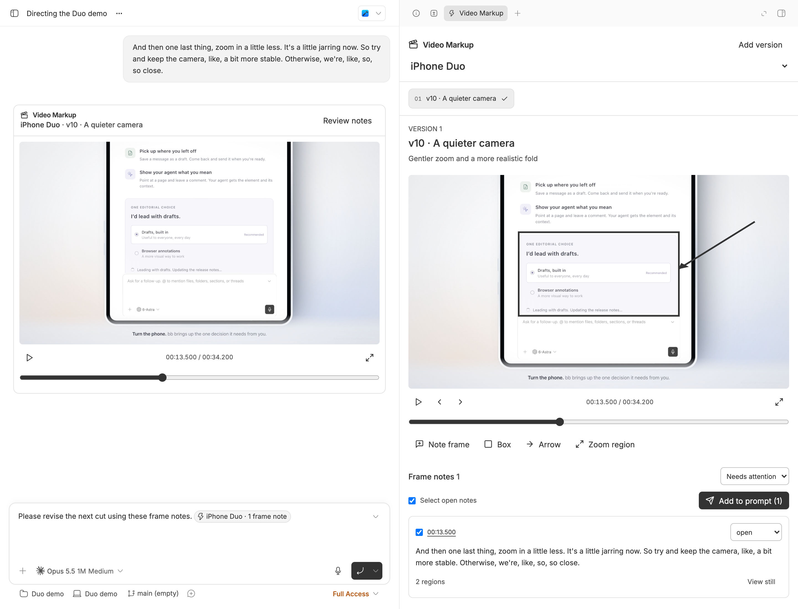

# Video Markup

Review product films without leaving bb. Open a video, mark a paused frame, and hand precise feedback to the agent alongside the captured still. The Video Markup thread panel keeps each demo's versions and unresolved notes together.



## Install

```bash
bb plugin install git:https://github.com/brsbl/bb-plugins.git@plugin/video-markup --yes
```

Requires bb 0.43.4 or newer for composer mentions with image context. Uses only public Plugin SDK surfaces. Install `ffprobe` on the machine holding the videos to identify frame timestamps. H.264 MP4 is the most portable review format; MOV and WebM playback depends on browser codec support.

## Use

Attach an `.mp4`, `.webm`, or `.mov` in bb's prompt box, or ask your agent to share a video. The agent calls `video_markup_present`, emits its inline player directive, and requests the Video Markup panel for that version. Videos use their filenames and ordered numbers. The current demo is reused; the first video's filename supplies the initial demo name. The existing demo selector switches between demos.

Opening a video in bb's file viewer also offers **Add as next version**. The panel has no add-video form or uploader. Its launcher cannot be hidden per thread with the current SDK, so an empty panel has one brief instruction.

Composer attachments are temporary host files: pass `attachment: true` / `--attachment` so Video Markup preserves them in its persistent plugin directory before turn cleanup. Ordinary renders are referenced in place; keep each render at a distinct durable path. Presenting the same unchanged file reuses its version.

Pause and choose **Note**, **Box**, **Arrow**, or **Zoom region**. Draw on the frame and type a note. Each note keeps its timestamp, captured still, and drawn shapes. ←/→ step one frame; space plays or pauses while the player is focused. Frame stepping uses packet timestamps, including variable frame rates; the probed or supplied FPS provides a constant-rate fallback if timestamp indexing is unavailable. Zoom regions mark desired focus; they do not alter the rendered film.

Select open notes and choose **Add to prompt**. A composer mention resolves to structured version/time/region feedback plus captured JPEG stills when sent. This preserves the existing draft and leaves sending to the user. Up to 12 notes fit one selection. Notes persist in plugin SQLite storage and sync across clients. Status can be **open**, **fixed**, **still wrong**, or **regressed**. Only unresolved statuses carry forward; copied notes preserve their original frame and version provenance.

Agents post a player using the returned directive, on its own line:

```text
::video-markup{version="VERSION_ID"}
```

The bundled **Product Demo Direction** skill records grounded camera, pacing, liveness, physical-motion, rendering, audio, and delivery guidance. It tells agents to read open notes before revising and present every attached or shared video through Video Markup.

### Tools and CLI

All commands return JSON and accept `--thread ID`; otherwise the CLI uses the active thread. Tool inputs accept `threadId`. Version and note lists return `nextOffset`; pass it as `offset` / `--offset` to continue.

| Agent tool | CLI | Inputs beyond the thread |
| --- | --- | --- |
| `video_markup_present` | `bb video-markup present --file PATH` | Optional `--attachment`, `--demo`, `--summary`, `--fps`. Registers if needed, requests the panel, and returns the player directive. |
| `video_markup_register_version` | `bb video-markup register --file PATH` | Same optional inputs; register without presenting. |
| `video_markup_versions` | `bb video-markup versions` | Optional `--offset`. |
| `video_markup_list_notes` | `bb video-markup notes` | Optional `--version`, `--demo`, `--status`, `--actionable`, `--offset`. |
| `video_markup_add_note` | `bb video-markup add-note --data '<JSON>'` | Version, timestamp, shapes, text, captured still. |
| `video_markup_update_note_status` | `bb video-markup status` | `--note`, `--status`. |
| `video_markup_context` | `bb video-markup context --data '<JSON>'` | `noteIds`: up to 12 selected actionable notes. |
| `video_markup_frame` | `bb video-markup frame --note ID` | Returns the captured still. |
| `video_markup_post_player` | `bb video-markup post --version ID` | Returns the directive for the agent to emit in its reply. |

```bash
bb video-markup present --file /absolute/demo-v10.mp4 --summary "Gentler zoom; full composer"
bb video-markup present --file /absolute/attachment.mp4 --attachment
bb video-markup notes --version VERSION_ID --actionable
bb video-markup status --note NOTE_ID --status "still wrong"
bb video-markup post --version VERSION_ID
```

For `add-note`, supply `versionId`, `timestamp` (seconds), `text`, `shapes`, and `still: {dataUrl, width, height}`. Shapes have `kind` (`box`, `arrow`, `zoom`) and `x1`, `y1`, `x2`, `y2` normalized to 0–1 relative to the video frame. The still is a JPEG data URL, at most 350,000 characters. Tool `video_markup_frame` returns a native image; CLI returns its data URL. `context` returns structured context and a saved selection ID used by the UI's composer mention. The agent emits the returned player directive in its reply; these commands never submit a user chat message. Panel opening uses public realtime events and `useBbNavigate().openThreadPanel()` in the visible thread header; when the thread is not open, the inline player still offers **Review notes**.

### Later

Scene maps/storyboards, promoting a note to the direction skill, and render automation/dashboards.

## Develop

Use this repository's remote CI for typechecks, builds, and tests. For a dedicated development bb instance:

```bash
cd /absolute/path/to/bb-plugins
npm ci --workspace=bb-plugin-video-markup --include-workspace-root --ignore-scripts
bb plugin install "path:$PWD/plugins/video-markup" --yes
```

Point that instance's `bb` CLI at its own server. **Install dependencies in this checkout before installing its path.** bb builds the frontend for path installs but does not run npm for them; dependencies in a different checkout or bb's own `node_modules` do not count. The scoped command above prepares Video Markup without installing every workspace or running native build scripts. A normal repository-wide `npm ci` also works. No separate local plugin build or production BB profile is needed.

The published `plugin/video-markup` ref includes self-contained frontend, server, and host bundles. Its release manifest points at those bundles and has no npm dependencies. CI rebuilds that exact release layout outside the repository's dependency tree via Video Markup's `test:built` script, independently of the catalog screenshot check.

Opening a file returns a playable URL after file checks; frame stepping becomes available when background probing finishes. A slow or failed probe never blocks playback. Registration reads duration, dimensions, codec, and FPS from a fast ffprobe stream/container query. A separate packet-timestamp query has a one-second budget and never discards those metadata on failure; no full-frame decoding scan is used. The host entry verifies file identity; it never renders, transcodes, or modifies source videos. Only temporary attachments are copied, using `experimental_paths.dataDir` on the thread's host. The backend streams HTTP byte ranges through public plugin HTTP and host RPC APIs, keeping reads to 256 KiB and avoiding the core file-preview size limit. It uses public `resolve().experimental_images` for image context. This additive mention field is documented in bb's public Plugin Guide; it is structurally compatible with this repository's pinned SDK declarations. The host minimum is scoped to Video Markup.
